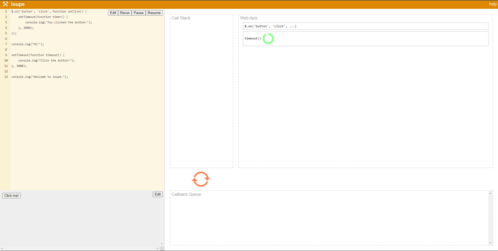

# ***Week 1.2*** : JavaScript Foundations

JavaScript is a "loose-ly" typed language where there is no specific datatype and a variable's type can be changed as and when needed.

JS is a single threaded language. Therefore no parallel computing allowed. Due to this it is sometimes considered bad for scalable systems.

## Simple primitives
| Primitive | Description |
|:---------:|:------------|
| **Variables** | **`var`**: initially `var` was used but now it is replaced by `let` <br/> **`let`**: used to define any variable whose value might be changed later <br/> **`const`**: cannot be changed after definition |
| **Data Types** | String, Boolean, Number |
| **if/else** statements | `if(condition) {true block} else {false block}` <br/><br/> `if(condition 1) {true block for condition 1}` <br/> `else if(condition 2) {true block for condition 2}` <br/>  `else {false block}` |
| **for/while** loops | `for(initialization; condition; updation) {loop body}` $\rarr$ every iteration, the iterator variable initialized in the initialization block gets updated and the condition is checked. If condition stills holds true that iteration runs else the loop will exit <br/><br/> `while(condition) {loop body}` $\rarr$ keeps running the loop body statements until the condition becomes false. |


## Complex Primitives
| Primitive | Description |
|:---------:|:------------|
|**Arrays** | homogeneous collection of data <br/> `let arr = [...]` |
|**Objects** | collection of key-value pairs where the keys are unique and they can be used to retrieve any value <br/> `let obj = {key: value}` |

### Arrays
```js
// without arrays
let person1 = "pavan";
let person2 = "navap";
let person3 = "vapan";
console.log(person1, person2, person3);

// using arrays
let people = ["pavan", "navap", "vapan"];
console.log(people[0], people[1], people[2]);

for(let i=0; i<people.length; i++) {
    console.log("Hello, " + people[i]);
}
```

### Objects
```js
// without arrays or objects
const person1 = "Pavan";
const gender1 = "M";

const person2 = "Navap";
const gender2 = "M";

// with arrays
const persons = ["Pavan", "Navap"];
const genders = ["M", "M"];

// with objects
const person1 = {
    firstName: "Pavan",
    gender: "M",
}

const person2 = {
    firstName: "Navap",
    gender: "M",
}

console.log(person1.firstName, person2.firstName);

let people = [person1, person2]
for(let i=0; i<people.length; i++) {
    console.log("Hello, " + people[i].firstName);
}
```

#### Examples
```js
/* Print all even numbers in an array */
let ages = [5, 10, 20, 21, 22, 23, 24, 25, 30, 51, 100]
for(let i=0; i<ages.length; i++) {
    if(ages[i]%2 === 0) {
        console.log(ages[i]);
    }
}
```

```js
/* Print biggest number in an array */
let ages = [54, 120, 200, 121, 22, 213, 245, 255, 300, 51, 100]
let maxNum = 0;
for(let i=0; i<ages.length; i++) {
    if(ages[i] >= maxNum) {
        maxNum = ages[i];
    }
}
console.log(maxNum);
```

```js
/* Reverse elements of an array */
let ages = [54, 120, 200, 121, 22, 213, 245, 255, 300, 51, 100]
let revAges = [];

// reversing
for(let i=ages.length, j=0; i>0; i++) {
    revAges[j] = ages[i];
}

// printing elements of reversed ages array
for(let i=0; i<revAges.length; i++) {
    console.log(revAges[i]);
}
```

```js
/* Print all male person's first name in given complex object */
const users = [
    {firstName: "Pavan", gender: "M"},
    {firstName: "Navap", gender: "M"},
    {firstName: "Vapan", gender: "M"},
    {firstName: "Vapana", gender: "F"},
];

for(let i=0; i<users.length; i++) {
    if(users[i].gender === "M") {
        console.log(users[i].firstName);
    }
}
```

## Functions
Functions allow us to
- abstract login in the program (like a black-box)
- take arguments as input and return a value as output
- reuse logic/code whenever needed (functions once defined just need to be "called" when needed and the whole code need not be re-written)
- increase readability of program
- modularize programs into sub-modules defined within functions

Functions are defined within function definitions whcih are not run initially. When the function is invoked/ called, only then the function is executed.

**Syntax (function definition)**: **`function <func_name> (parameters) { ... }`**

**Syntax (function call)**: **`func_name(arguments);`** 

There are cases where a function can take another function as an input, such functions are called as **callback** functions.


```js
// function definition
function sum(a, b) {
    let result = a+b;
    return result;
}

const value = sum(3, 4); // function call
console.log(value);
```

### Callback Functions
Callback functions are functions that take other functions as input i.e., in the function call,  another function is passed as an argument.

```js
function sum(n1, n2) {
    let result = n1 + n2;
    return result;
}

function displayResult(data) {
    console.log("Result of the sum is: " + data);
}

function displayResultPassive(data) {
    console.log("Sum's result is: " + data);
}


// only one function call is allowed
// result of number is to be displayed

let output = sum(1,2); // 1st function call
displayResult(output) // 2nd function call

// above is not the solution

/* SOLUTION 1: modify sum() to call displayResult() */
function sum(n1, n2) {
    let result = n1 + n2;
    displayResult(result);
}

// so now user has to only type
sum(1,2); // only 1 function call

// this solution works but has a problem
// if user wished to get the output as in displayResultPassive
// and not displayResult, then the sum() function has to be altered
// by the user which is not convinient

/* SOLUTION 2: Callback function */
function sum(n1, n2, funcToCall) {
    let result = n1 + n2;
    funcToCall(result);
    // sum() takes a function as argument and call that function
    // here the function called is the one sent so user can send
    // whichever function they wish to call and it gets called
}

// finally user has to type
sum(1, 2, displayResultPassive); // sum is a callback function now
// or sum(1, 2, displayResult); as per need
```

#### Examples
```js
/* WIHTOUT USING CALLBACKS */
function calculateArithmetic(a, b, type) {
    if(type == "sum") {
        const value = sum(a, b);
        return value;
    }
    if(type == "minus") {
        const value = sub(a, b);
        return value;
    }
}

function sum(a, b) {
    return a+b;
}

function sub(a, b) {
    return a-b;
}

const val = calculateArithmetic(1, 2, "sum");
console.log(val);
const val = calculateArithmetic(1, 2, "minus");
console.log(val);

/* USING CALLBACKS */
function calculateArithmetic(a, b, func) {
    const value = func(a,b); // calling function passed
    return value;
}

function sum(a, b) {
    return a+b;
}

function sub(a, b) {
    return a-b;
}

// passing sum() function as argument
const val = calculateArithmetic(1, 2, sum);
console.log(val);

// passing sub() function as argument
const val = calculateArithmetic(1, 2, sub);
console.log(val);
```

#### `setTimeout()` and `setInterval()`
```js
function greet() {
    console.log("Hello World!");
}

setTimeout(greet, 1000); // setTimeout(callbackFunc, timeToWait in ms)
// waits 1s then calls greet()

setInterval(greet, 1000); // setInterval(callbackFunc, timeToWait in ms)
// calls greet() every 1s
```

> **Recursion** is a function that calls "itself", while a **Callback** function is a function calling any other function that was passed as an argument. The feature that defines a callback function is that the function is being passed an argument, it does not call itself or anything (unless the function passed is the same function itself, then it becomes similar to a recursive function but is not natively a recursive function).


# ***Week 1.3*** : Basic JS APIs

### String

| Syntax | Return Value | Description |
|:-------|:------------:|:-----------:|
| `str.length` | `int` | Gets the length of `str`|
| `str.index(String target)` | `int` |Gets the index of a substring `target` in the string `str` (`target` could be just a single character or a sequence of characters i.e., a substring) |
| `str.lastIndexOf(String target)` | `int` | Gets the index of last occuring substring `target` in the string `str` (`str.index(target)` returns the index of first occuring substring in the string) |
| `str.slice(int start, int end)` | `string` | gives a substring from string, between the indices `start` and `end` |
| `str.replace(target, replacer)` | `string` | replaces the `target` within a string, with the value of `replacer` |
| `str.split(delimiter)` | `array[string]` | returns an array of strings, where each element is a substring obtained by splitting the string when the `delimiter` was encountered |
| `str.trim()` | `string` | Removed the leading and trailing spaces in a string |
| `str.toUpperCase()` | `string` | converts a string `str` to uppercase |
| `str.toLowerCase()` | `string` | converts a string `str` to lowercase |

### Number
| Syntax | Return Value | Description |
|:-------|:------------:|:-----------:|
| `parseInt(str)` | `Number (int)` | converts a string to a number |
| `parseFloat(str)` | `Number (float)` | converts a string to a floating point number |

There are some exceptional cases while using `parseInt` and `parseFloat`
```js
// converts string to an integer
function convToInt(str) {
    console.log("Input: " + str);
    console.log(parseInt(str));
}

// converts string to float
function convToFloat(str) {
    console.log("Input: " + str);
    console.log(parseFloat(str));
}

convToInt("42");        // 42
convToInt("42abc");     // 42
convToInt("abc42abc");  // NaN
convToInt("a4b2c");     // NaN
convToInt("3.14");      // 3

convToFloat("42");        // 42
convToFloat("42abc");     // 42
convToFloat("abc42abc");  // NaN
convToFloat("a4b2c");     // NaN
convToFloat("3.14");      // 3.14
```

# ***Week 1.4***: Loops, Functions and Callbacks
> it is a revision of previous topics which was explained slowly and in detail for some who couldn't understand. So, skipping this part in the notes

# ***Week 1.5***: Async, Await and Promises

**Synchronous**: together, one after the other, sequential i.e, only one thing is happening at a time

**Asynchronous**: opposite of synchronous, happening in parts parallely, i.e, multiple things are context-switching with each other.

JavaScript is a ***single-threaded*** language i.e., at a given instant it is performing only 1 task, but it uses context-switching (moving between tasks) and delegation (assigning tasks to other sub-threads) to give an illusion of multi-tasking. This is possible by the use of ***Asynchronous functions***.

`setTimeout()` is an inherent asynchronous function provided to us by default. So, when a call is made to the `setTimeout()` function it does not wait till it completes. It invokes the callback function provided, and moves onto the next line of code.

So, the `console.log("setTimeout called!")` is executed first, then after a second(1000 ms) the `console.log(findSum(100))` is executed.

```js
function findSum(n) {
    let ans = 0;
    for(let i=0; i<n; i++)
        ans += i;
    return ans;
}

function findSumTill100() {
    console.log(findSum(100));
}

setTimeout(findSumTill100, 1000);
console.log("setTimeout called!");
```

Some other examples of asynchronous functions are, 
- `fs.readFile`: to read a filefrom the filesystem
- `fetch`: to "fetch" data from an API endpoint

```js
const fs = require('fs'); // importing external library
fs.readFile("file.txt", "utf-8", function(err, data) {
    console.log(data); // prints the file contents
});
console.log("Hello world!");
```

In the above example, `console.log("Hello world!")` will be executed after that, `console.log(data)`, because `fs.readFile` is asynchronous.

> [Latent Flip JS visualizer](http://latentflip.com/loupe) is a nice way to visualize and understand the execution. 

### Promises
Until now, if a callback function is invoked, it performs it's task separately and once done, puts the result in a "callback queue". Once the main loop/ thread is free, it takes the result from the callback queue and now "actually" execute the callback function logic.

```js
function findSum(n) {
    let ans = 0;
    for(let i=0; i<n; i++)
        ans += i;
    return ans;
}

function findSumTill100() {
    console.log(findSum(100));
}

setTimeout(findSumTill100, 1000);
console.log("setTimeout called!");
```

Promises are syntactic sugar, that makes it "prettier" to write the above code; but under the hood, still uses the same logic of callbacks.

Also until now we have used pre-exixting asynchronous functions, but haven't created our own.

```js
const fs = require('fs');

function asyncFunc(callback) {
    fs.readFile("file.txt", "utf-8", (err, data) => {
        callback(data);
    });
}

function onDone(data) {
    console.log(data);
}

asyncFunc(onDone);
```

Here, the `asyncFunc()` is just a wrapper on top of the existing `fs.readFile()`, which means it is not our "own" asynchronous function, but this is what is the common use of `async` funtions. Usually all `async` functions we will write will be on top of some JS provided `async` function like `setTimeout()` or `fs.readFile()`. But this is the "***ugly***" way.

```js
const fs = require('fs');

function asyncFunc(callback) {
    return new Promise(function (resolve) {
        fs.readFile("file.txt", "utf-8", (err, data) => {
            resolve(data);
        });
    })
}

function onDone(data) {
    console.log(data);
}

asyncFunc().then(onDone);
```

Here, we can see a new `Promise` object being created that has a function taking in the parameter `resolve`. Upon completion of `fs.readFile()`, the `resolve` function is called. Also, when `asyncFunc()` is called, we are not sending the callback function, but using a `.then()` to which the callback function is passed. The reason to use `Promise` is to get rid of callbacks.

So, when the promise is "resolved", `asyncFunc()` returns a `Promise` object upon which the `then(callback)` method is called. `asynFunc()` immediately ans synchronously returns the `Promise` but is still pending, but the data comes asynchronously (later when promise resolves). When the `resolve()` is called, only then the `Promise` is resolved and the `.then()` can be executed. This is the more "***cleaner***" way.

```js
var promise = new Promise(); // throws error

// to initialize a Promise, it must be passed a function
// that also has a "resolve" parameter (can be differently named)
var promise = new Promise(function (resolve) { /* ... */ }); // or
var promise = new Promise((r) => { /* ... */ });

console.log(promise); // Promise { <pending> }
// because resolve() or r() was never called yet
```

Example:
```js
var promise = new Promise(function (resolve) {
    setTimeout(function() {
        resolve("TASK DONE");
    }, 1000);
});

function onDone() {
    // now the promise is resolved and will show the 
    // data returned in the resolve function call
    console.log(promise); // Promise { 'TASK DONE' }
}

// promise not yet resolved (needs 1 s)
console.log(promise); // Promise { <pending> }
promise.then(onDone);
```

### Async Await

It is also "syntactic sugar", that uder the hood uses callbacks and promises.

```js
function asyncFunc() {
    return new Promise(function(resolve) {
        setTimeout(function() {
            resolve("Hi there!");
        }, 1000);
    });
}

function normal() {
    asyncFunc().then(function(data) {
        console.log(data); // 'Hi there!'
    })
}

async function withAsync() {
    let value = asyncFunc();
    console.log(value); // Promise { <pending> }
}

// this is the real power of promises
// if any stmt in a function uses the await keyword,
// the function must be initialized with async
async function withAsyncAwait() {
    let value = await asyncFunc();
    console.log(value); // 'Hi there!'
}
```

The `withAsyncAwait()` uses no callbacks, no `.then()`, making it clean and understandable.

```js
function asyncFunc() {
    return new Promise(function(resolve) {
        setTimeout(function() {
            resolve("Hi there!");
        }, 3000); // wait for 3 secs
    });
}

async function main() {
    let value = await asyncFunc();
    console.log("Hi there1");
    console.log(value);
}

main();
console.log("after main");
```

In the above example the execution will be like:
- `main()` called, and as it is "`async`", it executed separately
- `console.log("after main")` executed immediately
- in `main()`, `asyncFunc()` is called and it waits for it to resolve. It doesn't execute `console.log("Hi there1")` yet.
- after 3 secs, when `asyncFunc()` is resolved only then does, `console.log("Hi there1")` get executed followed by `console.log(value)`

So, within the async function, await "holds" the sub-thread on which the asynchronous function is execting, but the main thread continues it's execution without waiting for the async function to complete.