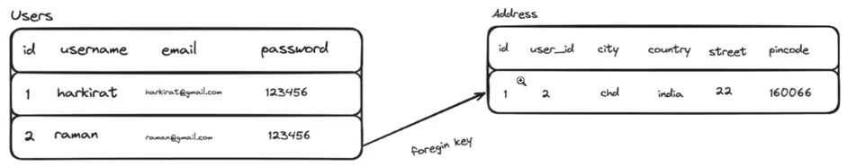
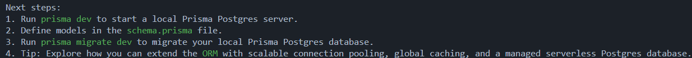
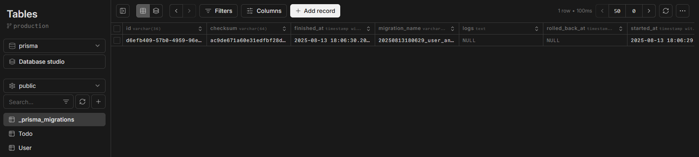
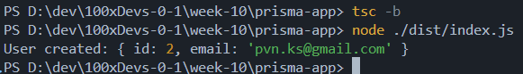

# _**Week 10.1: SQL and Postgres**_

**Types of DBs**: SQL, NoSQL, Graph and Vector databases.

1. **SQL** databases: follows a schema and data stored as rows and columns. (Ex:- MySQL, Postgres)
2. **NoSQL** databases: "_schema-less_" and beginner-friendly where data is stored as "_documents_" which is basically JSON format. (EX:- MongoDB)
3. **Graph** databases: data is stored in the form of graphs, where relationships/networds are need to be stored. (Ex:- Neo4j)
4. **Vector** databases: stores data in the form of vectors and useful in AI/ML to store embeddings. (Ex:- Pinecone)

> Free Postgress instance can be created in **NeonDB**, and _**`pg`**_ library allows to connect backend to the PostgressDB and put data into it.

Once we have a DB instance up and running, the first step is to create tables and for that we need to define a schema.

Exmaple schema:

```sql
CREATE TABLE users (
    id SERIAL PRIMARY KEY,
    username VARCHAR(50) UNIQUE NOT NULL,
    email VARCHAR(255) UNIQUE NOT NULL,
    password VARCHAR(255) NOT NULL,
    created_on TIMESTAMP WITH TIME ZONE DEFAULT CURRENT_TIMESTAMP
)
```

- **`SERIAL`**: auto-incrementing values in the column.
- **`PRIMARY KEY`**: column whose values allow to uniquely identify any record (row) in the table.
- **`VARCHAR(<num>)`**: defines type of column as "**variable charcaters**" of length "_`<num>`_".
- **`UNIQUE`**: constraint that enforces that values of that column must be unique without any duplicates.
- **`NOT NULL`**: constraint that enforces that the column cannot have enpty/null values.

## Interacting with database

### CRUD operations

1. **`INSERT`**: create a new row with specific values.

    ```sql
    -- SYNTAX
    INSERT INTO t_name (columns)
    VALUES (<column values>);

    -- EXAMPLE
    INSERT INTO users (username, email, password)
    VALUES ('username', 'user@xyz.com', '12345');
    ```

    Ensure that only single quotes are being used inside the **`VALUES`** clause, if no quotes or double quotes, will throw errror.

2. **`UPDATE`**: change values based on some condition

    ```sql
    -- SYNTAX
    UPDATE t_name SET col_name='value'
    WHERE --condition (row identifier)

    -- EXAMPLE
    UPDATE users SET username='new_username'
    WHERE email='user@xyz.com';
    ```

    Without the **`WHERE`** clause, the values for the whole column will get updated, hence it is important to provide proper condition to identify the specific records of that column and only update that.

3. **`DELETE`**: delete a row based on some condition

    ```sql
    -- SYNTAX
    DELETE FROM t_name
    WHERE --condition (row identifier)

    -- EXAMPLE
    DELETE FROM users
    WHERE id='1';
    ```

    Without the **`WHERE`** clause, the whole table will get deleted, hence it is important to provide proper condition to identify the specific row and only delete that.

    > In real-world scenarios, **`DELETE`** is never used in most cases and a column called '_deleted_' is added and set to true when something needs to be deleted, but the database entry is usually not removed for audit purposes.

4. **`SELECT`**: get data from the table (query)

    ```sql
    -- SYNTAX
    SELECT (columns) /* or * for all cols */
    FROM t_name WHERE --condition (row identifier)

    -- EXAMPLE
    SELECT * FROM users WHERE id='10';
    ```

    Without the **`WHERE`** clause, the whole table will be retrieved, hence it is important to provide proper condition to identify the specific row and only retrieve that.

### Input sanitization

Let's look at an example, where we are directly inserting user input into database without any sanity checks. This creates an opportunity for malicious actors to perform an "SQL Injection" where they can send in some specially crafted SQL code as input which when combined with the actual backend SQL query will transform into some other query which might corrupt the database or retrieve some results they shouldn't be able to see.

```ts
async function insertRow(row: User) {
  await db.connect();

  const result = await db.query(`
    INSERT INTO users (username, email, password)
    VALUES ('${row.username}', '${row.email}', '${row.password}');
  `);

  console.log(result);
}

// createUsersTable();
insertRow({ username: 'Pavan', email: 'pvn@gmail.com', password: '12345' });
```

In the above example, we are passing proper inputs so everything works as expected. With some malicious input like below, and delete entire table, which in an actual company would be a huge loss if they lose their entire userbase table.

```ts
insertRow({ 
    username: 'attacker', 
    email: 'sql@injection.com\'); DROP TABLE users;--', 
    password: 'does not matter'
});
```

Above inputs when interpolated into query becomes

```sql
INSERT INTO users (username, email, password)
VALUES ('attacker', 'sql@injection.com'); DROP TABLE users; -- ','doesnotmatter');
```

The proper way is not not directly add the user input into the SQL query, but to use a parametrized query instead. Now even if suer sends any SQL code as inputs, they are processed as the values to those fields and not as part of the query itself.

```ts
async function insertRow(row: User) {
  await db.connect();

  // $1, $2, $3 are like placeholders for 1st, 2nd and 3rd values
  // of the array passed as 2nd argument to the query() method
  const query = `
    INSERT INTO users (username, email, password)
    VALUES ($1, $2, $3);
  `;

  // input validation and check for SQL injections ...
  const result = await db.query(query, [row.username, row.email, row.password]);

  console.log(result);
}
```

## Relationships and Transactions

### Relationships between tables

2 tables containing "related" information like Users and Addresses tables, can be related by using thèprimary key of one of the tables, which becomes the forign key in the other table which can be used to identify that specific record.



In the above example, primary key of Users table is _`id`_ and the foreign key in Addresses table is _`user_id`_ which is the _`id`_ column of Users table.

The relationship is defined when creating the tables itself.

```sql
CREATE TABLE Users (
    id SERIAL PRIMARY KEY, -- PRIMARY KEY ----------------------|
    username VARCHAR(50) UNIQUE NOT NULL, --                    |
    email VARCHAR(255) UNIQUE NOT NULL,   --                    |
    password VARCHAR(255) NOT NULL,       --                    |
    created_at TIMESTAMP WITH TIME ZONE DEFAULT CURRENT_TIMESTAMP
); --                                                           |
--                                                              |
CREATE TABLE Addresses (       --                               |
    id SERIAL PRIMARY KEY      -- PRIMARY KEY                   |
    user_id INTEGER NOT NULL,  -- FOREIGN KEY <-----------------|
    city VARCHAR(100) NOT NULL,
    country VARCHAR(100) NOT NULL,
    street VARCHAR(255) NOT NULL,
    pincode VARCHAR(20) NOT NULL
    created_at TIMESTAMP WITH TIME ZONE DEFAULT CURRENT_TIMESTAMP,

    -- defining the relationship between Users and Addresses table
    FORIGN KEY (user_id) REFERENCES Users(id) ON DELETE CASCADE
);
```

### Joins

Joins are used when we have related tables and need to "join" the 2 tables to fetch specific data from both tables, at once.

> We can run seperate queries for both tables and get required data, but when the data required is complex and spans across multiple tables, this approach becomes obsolete and also is not a good practice.

Ex: to get all user info and thier addresses,

```sql
SELECT u.id, u.username, u.email, a.city, a.country, a.street, a.pincode
FROM users u
JOIN addresses a ON u.id = a.user_id
WHERE u.id = /* USER ID */;
```

Now we get all the mentioned data from 2 different (but related) tables in 1 query itself.

**Benefits** of using joins:

- **Reduced Latency**: single query gets required data so no need to wait for multiple queries to execute
- **Simplified Application Logic**
- **Transactional Integrity**: data might get changed between queries and if done separately, data might get mismatched.

### Types of Joins

- **`FULL JOIN`**: Returns records present in either of the 2 tables.
- **`INNER JOIN`**: Returns records present only in both the tables.
- **`LEFT JOIN`**: Returns records present in 1st table and may/not be present in 2nd table.
- **`RIGHT JOIN`**: Returns records present in 2nd table and may/not be present in 1st table.

```sql
SELECT -- columns
FROM table1 T1
-- by default JOIN = INNER JOIN
-- replace JOIN with specific FULL, LEFT or RIGHT JOIN as needed
JOIN table2 T2 ON T1.primary_key = T2.foerign_key
WHERE -- condition;
```

# _**ORMs (Object-Relational Mapping) and Prisma**_

ORMs are used to abstract the complexities of the underlying database into simpler, more easily managed objects within the code, i.e., **ORMs allow to easily interact with the database without worrying too much about the underlying syntax** (SQL).

**Benefits of ORMs:**

- **Simpler syntax**: easier to read syntax rather than complicated SQL queries.
- **Abstraction that allows to switch easily between databases** as it is not specific to any 1 database, queries are translated to appropriate syntax under the hood as per ther database being used, with the same **_unified API_**.
- **Type safety and Auto Completion**: appropriate types are inferred when using ORMs, which is just "_any_" without ORMs.
- **Automatic Migrations**
  - In a simple Postgres application, it is hard to keep track of all the commands/queries that were executed that led to the current schema of any table in the database.
  - ORMs maintains all of these as tables are altered (migration).

## Prisma ORM

Prisma is a NodeJS ORM thast uses TyopeScript with intuitive data model, automated migrations, type-safety and auto-completion.

### Setting up Prisma locally

```bash
$ npm init -y
$ npm install prisma typescript ts-node @types/node --save-dev
$ npx tsc --init
$ npx prisma init
```

Once Prisma is setup, the below output is seen in the terminal.



Next we need to define the DB type and thr URL in the _`schema.prisma`_ file under _`prisma`_ folder.

```prisma
datasource db {
  provider = "postgresql"
  url      = // postgres db url
}
```

### Defining the data models

```prisma
model User {
  id        Int     @id @default(autoincrement()) // PRIMARY KEY
  email     String  @unique // unique values
  firstName String? // ? -> optional
  lastName  String?
  password  String
  todos     Todo[]  // User can have todos stored in an array
}

model Todo {
  id          Int     @id @default(autoincrement())
  title       String
  description String?
  completed   Boolean @default(false)
  user_id     Int
  user        User    @relation(fields: [user_id], references: [id])
}

```

- Every model needs to have a key with _`@id`_ which defines the primary key of that table.
- Syntax to define a field is: _`fieldname d_type options`_
- options include _`@default`_ which is used to set default values for those fields, _`@unique`_ which enforces unique values and no duplicates and _`?`_ that says that specific field is optional, and may more.
- for relating the 2 tables, we need to add specific fields in both schema
  - **field to store the referred values** (of table 2) in table 1 i.e., _`todos Todo[]`_ field in _`User`_ table.
  - **foreign key** (refers to primary key of table 1).
  - **relation**: type is given as table 1 and _@relation_ attribute is used which takes the fields (foreign key/s) and references (primary key/s of table 1 the foriegn key of table 2 refers to), and this won't be an actual field in the table but a way for uss tell Prisma about the relationship.

Once we define the models, we need to perform a "migration" to initialize the database with the defines schema.

```prisma
npx prisma migrate dev --name UserAndTodoModels
```

This creates a new _`migrations`_ folder with a random numbers and the name we gave during migratioin command as name under which _`migration.sql`_ file is created. This contains the SQL translated version of the table creation code (models) written in _`schema.prisma`_.

```sql
-- CreateTable
CREATE TABLE "public"."User" (
    "id" SERIAL NOT NULL,
    "email" TEXT NOT NULL,
    "firstName" TEXT,
    "lastName" TEXT,
    "password" TEXT NOT NULL,

    CONSTRAINT "User_pkey" PRIMARY KEY ("id")
);

-- CreateTable
CREATE TABLE "public"."Todo" (
    "id" SERIAL NOT NULL,
    "title" TEXT NOT NULL,
    "description" TEXT,
    "completed" BOOLEAN NOT NULL DEFAULT false,
    "user_id" INTEGER NOT NULL,

    CONSTRAINT "Todo_pkey" PRIMARY KEY ("id")
);

-- CreateIndex
CREATE UNIQUE INDEX "User_email_key" ON "public"."User"("email");
```

Prisma actually ran the above commands on the dataabse, and the tables are created as per the schema defined as models. Also, a _`_prisma_migrations`_ table is seen in the database, containign details of that migration.



### Auto-genrated clients

```sh
$ npx prisma generate
```

Autogenerated clients expose classes for the data models defined in the _`schema.prisma`_ file i.e., we have User and Todo models which act as the schema for the tables when we perform a migration, but for us to use _`User.find()`_ and other functions, we need to have a User and Todo class available in our _`index.ts`_ file. Clients are the one that read the schema and expose the appropriate classes to be used in the _`index.ts`_ file.

The clients are created under _`@prisma`_ folder in _`node_modules`_ in a folder called _`client`_. This is not part of the main Prisma library in NPM registry, but something we generated as per our schema.

> Also, these autogenerated clients convert and create the SQL code.

## [CRUD operations](https://www.prisma.io/docs/orm/prisma-client/queries/crud)

First, we need to import the "**auto-generated**" client we created under _`node_modules`_.

```ts
import { PrismaClient } from "@prisma/client";
const prisma = new PrismaClient();
```

### [Create](https://www.prisma.io/docs/orm/prisma-client/queries/crud#create)

Using the client, we can access the classes for the created models and perform required **Create** operation.

```ts
// prisma.user.create({ data: { user ... } })
// and for adding multiple users if needed,
// prisma.user.create({ data: [{ user1 }, {user2}, ...] })
const user = await prisma.user.create({
  data: {
    email, password, firstName, lastName,
  },
});
```

In the above snippet, returned _`user`_ contains all the fields, if in some scenario we want only some specific fields back and not all, there is a _`select`_ key thattcan be added to mention only the fields we want.

```ts
const user = await prisma.user.create({
  data: { email, password, firstName, lastName },

  // returns back only the id and email of created user
  select: {
    id: true,
    email: true
  }
});
```



> If we try to insert an erroraneous record, and the create fails, the _`autoincrement()`_ function still runs, so upon next proper create/insert, 1 _`id`_ would be skipped (if once error occurs), and is same erroraneous data is tried to be inserted multiple times, **_`id`_ gets incremented each time even though any data is not actually inserted**.

### [Update](https://www.prisma.io/docs/orm/prisma-client/queries/crud#update)

For updating, we need to specify an identifier i.e., like how in SQL we used to specify **`WHERE`** to identify the row to be updated, same must be done here also, but syntax is a bit different.

```ts
// prisma.user.update({ where: { row-identifier }, data: { ... } })
const updatedUser = await prisma.user.update({
  // row-identifier
  where: {
    email: email,
  },

  // data to be updated
  data: {
    firstName: firstName,
    lastName: lastName,
  },
});
```

With Prisma, we can also perform some complex logic where we have to uopdate the table and delete all the completed todos for a specific user.

```ts
await prisma.user.update({
  where: {
    id: 1
  },
  // data to be updated
  data: {
    // which table to update
    todos: {
      // what operation to perform for the update
      deleteMany: {
        // based on what condition to perform said operation
        completed: true
      }
    }
  }
})
```

### [Read](https://www.prisma.io/docs/orm/prisma-client/queries/crud#read)

There are few types of methods that can be used to  read/retrieve data from a table, like _`findFirst()`_, _`findMany()`_, _`findUnique()`_, etc, where _`findUnique()`_ is most common used for finding just 1 record based on some condition (_`where`_ field).

```ts
// prisma.user.findUnique({ where: { rew-identifier }})
const user = await prisma.user.findUnique({
  // condition to identify specific record
  where: {
    email: email,
  },
});
```

> _**`prisma.user.findMany()`**_ retrieves all records from the table.

For **joins**, we can use the _`include`_ key in the query to also get additional data from another table.

```ts
const user = await prisma.user.findUnique({
  where: {
    id: 1
  },
  // joins 2 related tables and retrieved combined data
  include: {
    // related tables
    todos: true
  }
});
```

Above code gets the respective user asl well as the todos asscoiated with that user like _`{ user details, todos: [ {...}, ... ]}`_

### [Delete](https://www.prisma.io/docs/orm/prisma-client/queries/crud#delete)

Deletion is performed using _`delete()`_ method, and _`deleteMany()`_ to delete mutliple records.

```ts
const deletedUser = await prisma.user.delete({
  where: {
    email: email,
  },
});
```

> _**`prisma.user.deleteMany({})`**_ deletes all records.

## Filtering

```ts
let res = await prisma.user.findMany({
  where: {
    email: {
      endsWith: "gmail.com",
    }
    posts: {
      some: {
        published: true,
      },
    },
  },
  include: {
    posts: {
      where: {
        published: true
      },
    },
  },
})
```

In the above query, we are,

- Filtering the user based on email ending with "gmail.com" using the _`endsWith`_ clause has some posts which are published using _`some`_ clause.
- Filtering the posts retrieved from the Join (_`include`_) that only publshed posts are retrieved.

## Limits and Offsets

In SQL we can use a **`LIMIT`** keyword to limit the results to specific number of rows and also **`OFFSET`** to offset from which row the results are fetched starting from (Ex: If a table has 10 rows and we use **`OFFSET 2 LIMIT 5`**, then rows 3,4,5,6,7 will be fetched).

With this we can implement pagination where for first page we say **`OFFSET 0 LIMIT 10`**, for 2nd page **`OFFSET 10 LIMIT 20`**, and so on for next pages.

**For Pagination in Prisma**, we have _`take`_ and _`skip`_ clauses corresponding to the **`LIMIT`** and **`OFFSET`** clauses of SQL. Only thing is that in SQL the **LIMIT is based on final count like** **`OFFSET 10 LIMIT 20`**, but in Prisma _`take`_ just says **how many records to fetch at a time**: _`take: 10, skip: 10`_ not _`take: 20`_.

```ts
let page1 = await prisma.posts.findMany({
  take: 10,
  skip: 0
})

let page2 = await prisma.posts.findMany({
  take: 10,
  skip: 10
})
```

## Debug Logs

While instantiating the _`PrismaClient()`_ we can use the _`logs`_ argument with some specific keywords to control the verbosity of logs when Prisma runs the queries, and few workarounds.

> Prisma doesn't give options to print the query parameters as it might be sensitive or secret information in most real-world cases, but they provide some workarounds like using some event listeners and parameters on the **PrismaClient()** object to get this functionality.

```ts
// debug.ts
const prima = new PrismaClient({
  logs: [
    {
      // emits a "query" event when we run a query
      emit: "event",
      level: "query",
    }
  ]  
})

main() {
  /* query */
}


prisma.$on("query", async (e) => {
  console.log(`${e.query} ${e.params}`)
});
```