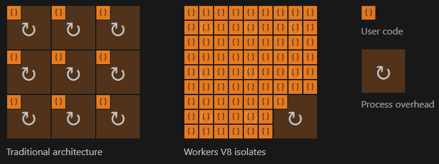
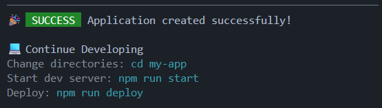
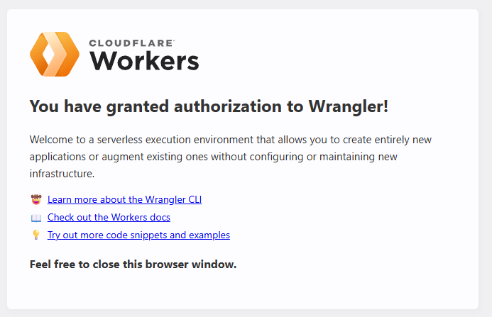
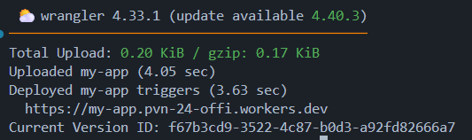

# **_Week 11.1: Serverless Backends_**

Till now we have only hosted the backend locally and connected it with the frontend, but in real-world scenarios, the backend of a web application is deployed on a server (either physical on-prem server or cloud server using Cloudflare, AWS, Azure or GCP).

**When deployed on cloud**,

1. Go to AWS, GCP, Azure or Cloudflare, rent a VM (Virtual Machine) and deploy the app.
2. Put the VM in an Auto-Scaling group.
3. Deploy it in a  Kubernetes cluster.

**Problems with the above deployment architecture**:

- When and how to scale server.
- Base cost even though server is not used 100%.
- Monitoring various servers to make sure no server is down.

**Solution**: Developer only writes code and "_someone_" else handles all the auto-scaling, montioring, etc.

---

**Serverless** is a backend deployment in which the **cloud provider dynamally mes allocation and provisioning of servers** and the term _"serverless" does nnmean there are no servers involded, but that the developer does not worry about any servers_.

The developer writes their backend code and runs a command, and the app would automatically **Deploy, Autoscale and Charge on a `per-request` basis** (rather than base cost fo VMs).

**Problems with Serverless backends**:

- More expensive at scale (at which point we go back to the previous VM based deployments)
- Cold start problem: When no user is accessing the backend, then no servers will be running and the backend will be shut-down, but when someone ccs to the website, now suddenly the server needs to "cold-start", which causes high latency initially.
  - So, to solve this either we can be pinging the backend passively to keep it up, or
  - Maintain a "**Warm Pool**", where atleast 1 server is always running to handle any sudden requests.

**When to use Serverless architecture**:

- When need to host a backend fast and not worry about deployment.
- When we cannot anticipate the traffic and don't wanto to worry about Autoscaling yet.
- If traffic is very low and we want to optimize for cost.

## **Serverless Providers: AWS Lambda, Google Cloud Functions, Cloudflare Workers**

We will be using Cloudflare Workers since it is free for upto certain number of requests initially.

### Deploying a Cloudflare Worker

1. Open [Cloudflare Dashboard](https://dash.cloudflare.com/88e8c4bd2ebef02b064b328e138a8c44/home/domains).
2. Navigate to the **Workers and Pages** page.
3. Select "**Start with Hello World!**".
4. A page showing a basic route returning `"Hello World"` response is shown.
5. Click on "**Deploy**".

### [**How Cloudflare Workers works**](https://developers.cloudflare.com/workers/reference/how-workers-works/)

**Cloudflare Workers don't use NodeJS runtime** and they have created their own runtime with many things that NodeJS has.

Cloudflare Workers behave similarly to JavaScript in browsers and NodeJS, but under the hood the Workers runtime used the V8 engine (which became NodeJS) and the differences between JavaScript for browser/NodeJS and Cloudflare Workers is at the runtime. Rather than running on an individual's machine (browser application or centralized server), Workers functions run on Cloudflare's Edge Network - a growing global network of thousands of machine distributed across hundreds of locations.

Each of those machines hosts an instance of the Workers runtime, and each of those runtimes is capable of running thousands of user-defined applications.

### Isolates vs Containers

V8 orchestrates Isolates which are lighweight contexts the provide our code with variables it can access and a safe environemnt to be connected within. A single runtime can run hundreds/thousands of isolates, seamlessly switching between them.



If there are 9 apps, instead of running NodeJS (traditionally) 9 times, Workers runtime runs the process once and switches between apps as per requirement. Workers processes are able to run essentially limitless scripts with almost no individual overhead. Any given isolate can start around a hundred times faster than a Node process on a container or virtual machine.

### Initializing a Worker

1. Initialize a Worker:

    - **`npm create cloudflare -- my-app`**
    - What would you like to start with? -> **`Hello World example`**
    - Which template would you like to use? -> **`Worker only`**
    - Which language do you want to use? -> **`TypeScript`**
    - Do you want to deploy your application> -> **`No`**

    Once application is created the below output is shown in the terminal.

    

    In the created **`my-app`** folder, under **`src`**, there will be an **`index.ts`** that contains:

    ```ts
    export default {
        async fetch(request, env, ctx): Promise<Response> {
            return new Response('Hello World!');
        },
    } satisfies ExportedHandler<Env>;
    ```

    **`npm run dev`** runs the Worker locally on port 8787 which just returns "**Hello World**" for now.

> In _`package.json`_ there is only one actual dependency which is _`wrangler`_, the CLI for CloudFlare. It does not have _`express`_ as a dependency, as we are not writing express logic, own the HTTP server, which is handled by CLoudFlare.

### Routing

```ts
export default {
    async fetch(request, env, ctx): Promise<Response> {
        console.log(request.body);
        console.log(request.headers);
        console.log(request.url);  // http://127.0.0.1:8787/
        const path = request.url.slice(21)

        if (path == '/') {
            // handle / route
            if (request.method === 'GET') {
                return Response.json({ message: 'Received GET request' });
            } else {
                return Response.json({ message: 'Did not receive a GET request' });
            }
        } else if (path === '/users') {
            // handle /users route
            return Response.json({ message: '/users path' })
        } else {
            return Response.json({ message: '404 | Not Found' })
        }
    },
} satisfies ExportedHandler<Env>;
```

Routing is done with conditional statements and is not optimal as for bigger applications the routing becomes very messy.

### Deploying worker

1. Login to CloudFlare account: **`npx wrangler login`** because we need to give wrangler access to our CloudFlare account to push the Worker there.
2. OAuth -> Opens in Browser and requests access -> Allow
3. Wrangler is granted access to our CloudFlare account.
    
4. **`npm run deploy`** runs **`wrangler deploy`** and sincle wrangler has access to the CloudFlare account, it uploads the code to a new Worker.
    
5. The above command publishes/deploys a worker (for free) and give a URL which is available on the internet => _**we can host our backend for free like this**_.

### Why **`express`** doesn't work on Workers and Workarounds

- **`express`** heavily depends on **`NodeJS`** and hence can't be hosted on a serverless runtime.
- If really needed to convert Express-NodeJS code into a Worker, extract all the generic logic into functions and keep the base code as generic as possible so easier to re-write for Workers.
- [**`Hono`**](https://hono.dev): very fast JS framework for writing CloudFlare Workers.

### Hono

**`npm create hono@latest <app-name>`** creates a Hono App with biolerplate code (use "**`cloudflare-workers`**" template).

```js
import { Hono } from 'hono'

const app = new Hono()

// c provides request and response parameters
app.get('/', (c) => {
  return c.text('Hello Hono!')
})

export default app
```

This code is very similar to express with the routing logic.

- **Accessing request body, headers and query parma**

    ```js
    // await c.req.json() -> gives request body
    app.post("/body", async (c) => {
        return c.json({ message: "POST /body", body: await c.req.json() });
    });

    // c.req.header('parameter') -> retrieves parameter from header
    app.get("/header", (c) => {
        return c.json({
            message: "GET /header",
            auth: c.req.header("Authorization"),
        });
    });

    // c.req.query('param') -> retrieves the query param
    app.get("/query", (c) => {
        return c.json({ message: "GET /query", query: c.req.query("param") });
    });
    ```

- **Middlewares**

    ```js
    async function authMiddleware(c: any, next: any) {
        const authHeader = c.req.header('Authorization');
        if (authHeader) {
            // auth check

            await next()
        } else {
            return c.text('Unauthorized')
        }
    }

    // directly use on app
    app.use(authMiddleware);

    app.get("/", (c) => {
        return c.json({ message: "GET /" });
    });

    // use in specific routes
    app.get('/user', authMiddleware, async (c) => {
        // ...
    })
    ```

# **_Week 11.2: AWS_**

> Don't have an AWS account, so just taking down important points here. Won't add details of how to perform operations here.

**AWS** is Amazon's cloud provider service. It lets us **rent servers as EC2 instances, manage domains, upload objects in S3 buckets** (mp4, pdf, images, mp3, etc), **auto-scale servers and create Kubernetes clusters**.

For, us the main focus is on renting servers as this would allow us to host a backend on AWS and hit that in our frontend.

## EC2 servers (Elastic Compute v2)

- Elastic -> can increase/decrease the size of the machine
- Compute -> CPU, RAM, HDD: basically a machine to run code

When creating an EC2 instance, there is an option to create a **Key-Pair** which creates a public and a private key which can be used to SSH into the EC2 instance machine and login/access it. It downloads a `.pem` file which contains the the private key which shouldn't be shared to anyone.

If we want to use SSH (port no: 22), then we need to hit the IP of the server, but we need to allow the EC2 instance to get SSH'd from the IP of our computer, so we need to set the '_Allow SSH from_' and if we put `0.0.0.0/0`, then it can get accessed from anywhere. Also, we need to tell AWS which ports to be open to the Internet using the "_Allow HTTPS/HTTP traffic from the Internet_" options which can be accessed from anywhere by default (because we don't generally specify ports for HTTPS/HTTP as we want the internet to access our app on say `app.100xdevs.com` on default 443 and 80 ports and not `app.100xdevs.com:3000`). So at the end, the **EC2 instance will have ports 22 (SSH), 80 (HTTP) and 443 (HTTPS) open**.

When we login to AWS, we can select a region on the topbar. For our use case we would select _**Asia Pacific (Mumbai)**_ i.e., `ap-south-1`. For our EC2 instance also it will have an `Availability Zone` within the selected reqion, for example `ap-south-1a`.

Every EC2 instance deployed, will have a Public IP which is the main reason we are renting a server, so now _**anyone on the Internet can reach our EC2 instance on the provided Public IP**_.

### Connecting to the EC2 instance

We would be using SSH to connect to the EC2 instance to deploy our code/app onto the server. So, firstly we need to navigate into the folder where our Private Key (Certificate) i.e., `private-key.pem` file is saved and open a terminal there. In the terminal,

```sh
# ssh: starts the ssh command 
# -i <file>: input file
# machine@ip: tells ssh machine name and the public IP where it is available
# $ ssh -i <file> <machine>@<ip>

$ ssh -i private-key.pem ubuntu@13.234.111.39
```

It gives a Warning that Private Key file is unprotected and has Permissions 0644 on it. This basically says that UGO (User, Group, Other) have 644 access: User has Read and Write access (6 -> 110 for RWX), Groups and External users (Others) have Read access (4 -> 100 for RWX). So we need to ensure that no one other than the current logged in User can access the file. Run the following command in the terminal.

```sh
# chmod: change permissions on a file
# access = 700: gives full Read, Write and eXecute (7 = 111 -> RWX) access to logged in User
#      No access (0 = 000 -> RWX) to Groups and Others
# <file>: file whose permissions are to be chnaged
# $ chmod <access> <file>

$ chmod 700 private-key.pem
```
Now it would say "_Welcome to Ubuntu ..._" and we can access the server, and the pwd (present working directory before `$`) changes to `ubuntu@ip$` and is green in color. Now we can execute commands directly on the EC2 server via the CLI.

To exit the SSH session we just type `exit` into the terminal and it closes the SSH session.

### Internet access on EC2 instance

EC2 instances by default don't have access to the Internet themselves (ping any website and it returns failed "_Temporary failure in name resolution"_), so we need to setup that if we wish to clone a repo in the EC2 instance. This means that the server is not able to hit the DNS server.

To solve this we need to edit a comfig file on the server i.e., `/etc/resolv.conf` using `nano` or `vim` with **sudo** access.

```sh
$ sudo vi /etc/resolv.conf
```

- Press I: Puts Vim in INSERT mode so we can edit the file
- Navigate to the file where some defult entries are present (ex: `nameserver 127.0.0.53` -> localhost not DNS)
- Press Entre and add `nameserver 8.8.8.8` which is the entry for the DNS server.
- Press Escape key followed by **`:wq` which writes changes and quits vim**.

Now when we ping any site like _google.com_, it sends packets so now the server can perform DNS resolution and access the Internet.

### Next Steps

Since we are trying to deploy our backend/frontend on AWS, we first need to install NodeJS. We can use [NVM (Node Version Manager) to install NodeJS](https://medium.com/geekculture/how-to-install-node-js-by-nvm-61addf4ab1ba) on the server via the CLI. 

Install project dependencies using NPM (`npm install`) and then run the code using `node`.

If the project/backend in listening on any other port (other than the opened ports on the server), we need to open the specific port on the server from the AWS Dashboard.

- Select the Instance.
- Click on the Security tab and click on the security rules link.
- Under **Inbound Rules**, click "_Edit inbound rules_".
- Scroll to the end, click "_Add Rule_" and add the required port: `Custom TCP: Port.`
- Click on '_Save Rules_'.

_**Now our NodeJS application is deployed on an EC2 instance from AWS, accessible via the Internet using the respective port.**_

> If we make the NodeJS app listen on port 80, then don't need to add the specific port since 80 is default, but it won't work because our NodeJS app doesn't have enough credibility to run on port 80 which is a standard port reserved for HTTP protocol.

## Reverse Proxies

Most of the times, we don't have just 1 app running on the server and need to have multiple applications on it, but we can't use the same 80 port for all of them, and each would be running on a different port. This is where we make use of **_Reverse Proxy_ which would be running on 80 and it will decide which application to route traffic to**.

- Forward Proxy: Server which forwards user to destination server (Ex: VPN)
- Reverse Proxy: Listening on the destination server and forwards requests within the server to different applications.

### `nginx`

To implement Reverse Proxy on our server, we first need to install `nginx`, which offers many services but the only thing we are using it for now is to add a Reverse Proxy to our server.

```sh
$ sudo apt install nginx
```

When installed, it automatically starts `nginx` and by default `nginx` takes over the port 80 with a "_Welcome to nginx!_" message when we hit port 80 on our server.

Next we need to create the Reverse Proxy by telling `nginx` where to point. For this we need to edit the config file which currently has some default configurations. So we can delete that file, create a new one and add our condigs there.

```sh
$ sudo rm sudo vi /etc/nginx/nginx.conf
$ sudo vi /etc/nginx/nginx.conf
```

In the `nginx.conf` file, we need to add:

```conf
events {
    # Event directives
}

http {
    server {
        listen 80
    }
}
```