# **_Week 2.2_** : Node.js runtime & HTTP

**ECMAScript**: Scripting language specification upon which JavaScript is based. It defines what can be done using JavaScript

**JavaScript**: Scripting language that conforms to the ECMAScript specification. It is the most widely used implementation of ECMAScript. JS also includes some other features not part of ECMAScript.

> **_ECMAScript_** is the **specification** and **_JavaScript_** is the **implementation**

**V8 Engine**: V8 is an open-source JavaScript engine developed by Chromium project for Chrome and Chromium browsers. It is written in C++, and is responsible for converting JS code into native machine code. It is the most prominent JS compiler, even used in Node.js. Mozilla Firefox uses different engine called **Spider Monkey** written in C and RUST.

Initially JS was never meant to be run outside the broswer. Later, the v8 engine was "pulled out" of the browser environment, encapsulated with some common functionality required to develop backends (provided by Java or Golang at that time) and **Node.js** was created, that could run JS code outside the browser on the local machine.

**Node.js**: runtime that can run JS code

**Bun**: a Node.js competitor that is a significantly "faster" JS runtime compared to Node.js. It is written in a language called **Zig**

## **HTTP Server**

**HTTP**: HyperText Transfer Protocol defines how machines communicate. In the context of web development, it is used for Frontend and the Backend to communicate.

**HTTP Server**: exposes the backend to the frontend or client. It waits for incoming requests and responds appropriately.

|     Things needed to be known by client     |     Things needed to be known by server      |
| :-----------------------------------------: | :------------------------------------------: |
|         **Protocol**: HTTP / HTTPS          |                    &nbsp;                    |
|  **Address**: server URL, IP, port number   |               Response Headers               |
|        **Route**: navigation routes         |                Response Body                 |
|       Headers, Body and Query params        |    Status Codes (200, 305, 401, 500, ...)    |
|        Method (GET, POST, PUT, ...)         |                    &nbsp;                    |
| 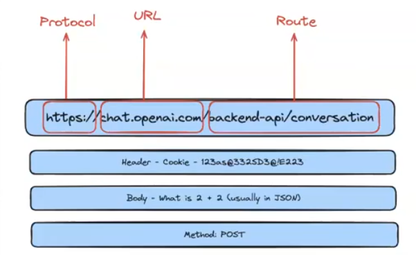 | 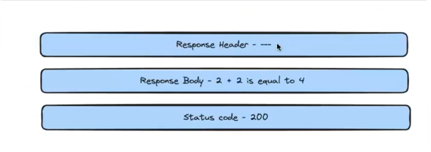 |

### What happens when a request is sent (when we search something in browser)

1. Browser **parses URL** and gets the protocol, url and route
2. Browser does a **DNS (Domain Name Service) Lookup** (conversion of url like www.google.com to respective IP address of google, because to find any machine in a network IP address is what is required) aka DNS resolution.
3. **Establishes a connection** by performing a "handshake" (series of establishment packets and acknowledgements)

### HTTP methods

1. **GET**: to retrieve some data from the server
2. **POST**: to send some data to the server
3. **PUT**: similar to POST, but used if needed to update some data on the server
4. **DELETE**: used to remove some data from the server

### HTTP Status Codes

1. 200 range: everything is ok/ success
2. 300 range: redirect to elsewhere
3. 400 range: error on client side (404 - page not found => user typed wrong address, 403 - authentication issue)
4. 500 range: error on the backend (internal server error => some error occured upon running code in the backend server)

### Simple HTTP Server using express library

```js
const express = require("express");
const port = 3000;

const app = express(); // initializes express

// exposing a route
app.get("/", function (req, res) {
  res.send("Hello world!!");
});

// binding server to a port and make it listen to requests
app.listen(port, function () {
  console.log("Server listening on port", port);
});
```

Express allows us to define route handlers for GET, POST, ... requests i.e., if a GET request is sent to the route "/", it reaches the route handler defined by `app.get("/", (req, res) => {...})`. `req` contains the request data (headers, body, params) and `res` allows to send the reponse to the request.

POST requests contain more information than GET requests as it is some information for the server.

```js
app.post("/post-handler", (req, res) => {
  const req_headers = req.headers; // object with headers
  const req_body = req.body; // undefined ??
});
```

Express "just doesn't provide functionality to access body of request". We must use another library called **`body_parser`** for this. Body parser will take the JSON data from the request body and puts it into **`req.body`**.

```js
const express = require('express');
const bodyParser = require('body-parser');

// ...
// use body parser for json data
app.use(bodyParser.json());

// app.get("/", ...)
app.post("/", (req. res) => {
    console.log(req.body); // object containing body of request
});
// app.listen(port);
```

We can also just use **`express.json()`** in place of body parser.

```js
const express = require('express');
app.use(express.json());

app.post("/", (req. res) => {
    console.log(req.body);
});
```

> The body parser module enables us to parse incoming request bodies in middleware. Express server needs to know what data is being sent over the server so it can parse it. Hence when we use express.json() in the app.use(), we are telling express server that incoming data is of json type. Now it knows how to parse it and works well.

### Query Params

Query params are a way to send data in the url itself. To send request body, it is not possible to make that json object and put it directly in the searchbar or the browser. So, at that time a way to send some amount of data is the **Query Parameters**.

In a URL, after the route, a **`?`** is present, followed by query variables. The **`?`** denotes the beginning of the "query string".

Ex: http://localhost:3000/conversations **?userId=2**

**`userId`** is a query parameter with the value 2. To send multiple parameters, **`&`** is used to separate the parameters.

Ex: http://localhost:3000/conversations **?userId=2&theme=dark**

To access these query params within the node.js code, we can use the **`req.query`** object.

```js
app.get("/conversations", (req, res) => {
  user_id = req.query["userId"];
  theme = req.query["theme"];

  console.log(user_id, theme); // 2 dark
});
```

## **Environment Variables**

Most of the projects will use environment variables to define port numbers, usernames, api keys, database passwords, etc and other constant information. This is defined in a `.env` file that won't be knwon to all.

```js
// .env file
PORT = 5000;
// ... other information
```

To use these environment variables within our node.js project,

```js
const dotenv = require("dotenv");
dotenv.config();

// if there is a PORT environment variable use that value
// if not there then ue 3000 (|| => or)
const port = process.env.PORT || 3000;
```

Another way of doing the same is by **exporting the environment variable via terminal**. This is not used much as the command has to be run everytime when we are running that terminal for the first time.

```sh
$> export PORT=3000
```

To use this,

```js
// just use it directly no need for dotenv
const port = process.env.PORT || 3000;
```

# **_Week 2.3_** : Bash and terminal

|                 Commands                  | Description                                                                                                                                                                                                                                                                                                                                                                        |
| :---------------------------------------: | ---------------------------------------------------------------------------------------------------------------------------------------------------------------------------------------------------------------------------------------------------------------------------------------------------------------------------------------------------------------------------------- |
|                 **`pwd`**                 | Print working directory i.e., the base root directory                                                                                                                                                                                                                                                                                                                              |
|          **`cd <destination>`**           | Change directory to the argument. `destination` can be another folder or **`..`** => move one level back i.e., to parent directory, and many other options as well                                                                                                                                                                                                                 |
|                 **`ls`**                  | List the files and folders in the directory                                                                                                                                                                                                                                                                                                                                        |
|       **`mkdir <directory name>`**        | Make Directory => create a new folder                                                                                                                                                                                                                                                                                                                                              |
|       **`rmdir <directory name>`**        | Remove Directory => removes the provided directory if it is empty. If it contains something, `rm` must be used.                                                                                                                                                                                                                                                                    |
|          **`touch <file.ext>`**           | Create a new file                                                                                                                                                                                                                                                                                                                                                                  |
|           **`cat <file.ext>`**            | Print the contents of the given file                                                                                                                                                                                                                                                                                                                                               |
|            **`vi <file.ext>`**            | open up Vim to edit a file                                                                                                                                                                                                                                                                                                                                                         |
| **`mv <source_path> <destination_path>`** | Used to move a file or a folder. If the `source_path` and `destination_path` are actual filenames (**file.ext**), the source file will just ge renamed. If the `source_path` is fo a file and `destination_path` is a path to a directory, file will get moved to that directory, and if the `destination_path` ends with a filename, the file will get moved and renamed as well. |
| **`cp <source_path> <destination_path>`** | Used to copy a file or a folder. While copying entire folder (with contents inside) an **`-r `** flag has to ge given that stands for **recursive** like: **`cp -r folder1 folder2`**                                                                                                                                                                                              |
|           **`rm <file_path>`**            | "removes" or deletes the file specified. If the `file_path` points to a directory/folder with some content in it, **`rm -r <folder>`**                                                                                                                                                                                                                                             |
|             **`echo <text>`**             | displays the argument onto the terminal. If the argument is some special variable name, like **`$PATH`** will show the environment variables, and other special variables show different data.                                                                                                                                                                                     |
|           **`head <file.ext>`**           | shows first 10 lines of that file in the terminal. We can use a `-n` flag to specify the number of lines to be shown also like: **`head -n 3 file.txt`** to print only the first 3 lines or just **`head -3 file.txt`** also works.                                                                                                                                                |
|           **`tail <file.ext>`**           | shows last 10 lines of that file in the terminal. We can use a `-n` flag to specify the number of lines to be shown also like: **`tail -n 3 file.txt`** to print only the last 3 lines or just **`tail -3 file.txt`** also works.                                                                                                                                                  |

There are some other commands non-specific to linux.

|       Commands       | Description                                                                                                                                                                                       |
| :------------------: | ------------------------------------------------------------------------------------------------------------------------------------------------------------------------------------------------- |
| **`node <file.js>`** | runs the file provided as argument, if no argument given => converts the terminal (bash shell) to a node environment where JS cose can be executed (node shell -> like in the console of browser) |
| **`npm <package>`**  | Node Package Manager is used to install external packages locally                                                                                                                                 |

# **_Week 2.4_** : Advanced Bash and terminal commands

## **`ls`**

As we know `ls` "lists" the files and folders of a given directory or the present working directory of no argument is given. But, there is more to ls.

- **`-l`** flag => gives detailed listing of the directory, wil the type of file, the permissions for user, groups and external users, date modified, etc. <br/>
  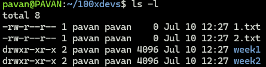

- **`-R`** flag => recursively lists all the contents in all sub-directories. <br/>
  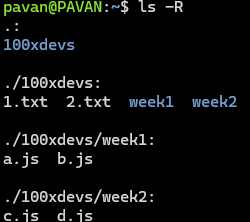

- **`-t`** flag => lists the contents such that last modified file appears first. <br/>
  

- **`-a`** flag => shows the hidden files too (.git files are generally hidden)

- **`-s`** flag => list the files based on size <br/>
  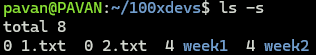

We can also combine these flags for better understanding. Like if we want to see the files listed with the timestamp, permissions, etc ordered my the last modified.

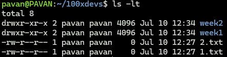

We can use wildcards in the argument for ls to get specific types of files, like we want to see all the js files only


## **`cd`**

`cd` followed by a path will change the present working directory to that location specified in the path. In place of the path, there are some special symbols like,

- **`cd ..`** => move to parent directory (.. is not any path here). This works on multiple levels also like: **`cd ../..`**.

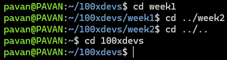

## **`cat`**

As we know `cat` which stands for **concatenate** will display the contents of a file.

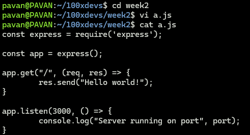

**`cat > file.ext`** : "write" follwoing typed content to the **`file.ext`**. This will replace any exixting content.

**`cat >> file.ext`** : "append" following typed content to **`file.ext`**. This will not replace but add the typed content to the end of the file after the existing content.

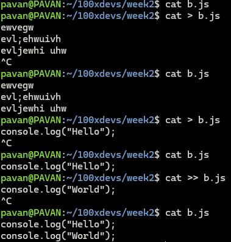

The output of cat is not numbered (line numbers are not shown). If we need the line numbers also to be shown we can use the **`-n`** flag.

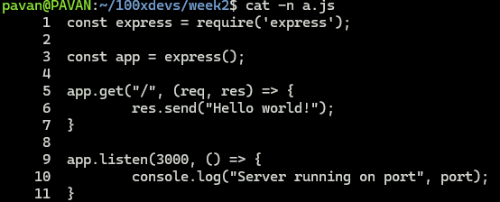

## **`mkdir`**

`mkdir` is used to create an empty directory. but what if we want to create multiple directories at the same time. The **`-p`** flag can be used for that.

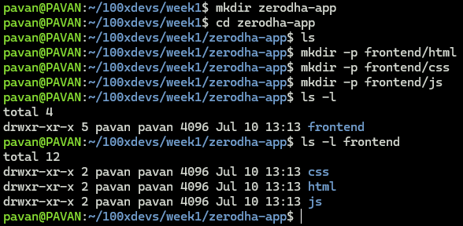

## Permissions (**`chmod`**)

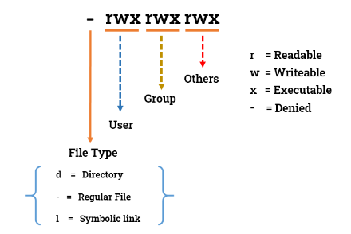

`chmod` allows us to change file permissions. It requires 4 data,

1. whose permission we are changing: **`u`** (user), **`g`** (group), and/or **`o`** (others)
2. adding (**`+`**) or removing (**`-`**) following permissions
3. permissions: read (**`r`**), write (**`w`**) and/or execute (**`e`**)
4. file to which the above permissions must be applied to

If it is a folder for which permissions are to be modified, a **`-R`** flag must be added too.

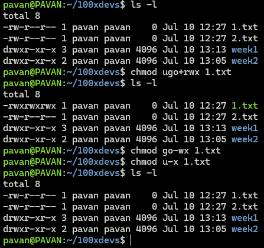

We can also use numbers (octal system) to set the permissions

| Number | Read | Write | Execute |
| :----: | :--: | :---: | :-----: |
|   0    |  0   |   0   |    0    |
|   1    |  0   |   0   |    1    |
|   2    |  0   |   1   |    0    |
|   3    |  0   |   1   |    1    |
|   4    |  1   |   0   |    0    |
|   5    |  1   |   0   |    1    |
|   6    |  1   |   1   |    0    |
|   7    |  1   |   1   |    1    |

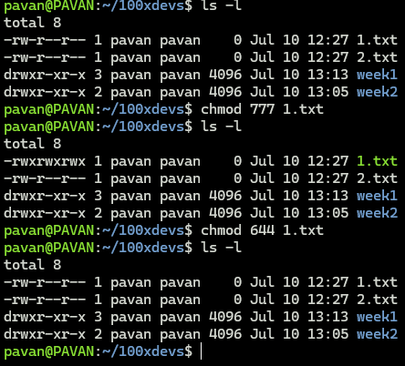

## Pipe (|) operator

It is used to chain commands. The operand before `|` will pass it's output to the next operand (after the `|`) upon which the operation will take place.

**`$ command 1 | command 2`**: whatever output is given by command 1 is given as input to or "flows to" command 2

An example is chaining **`head`** and **`tail`** commands to view specific portions of the file. Also **`cat`** command can be used along with them.

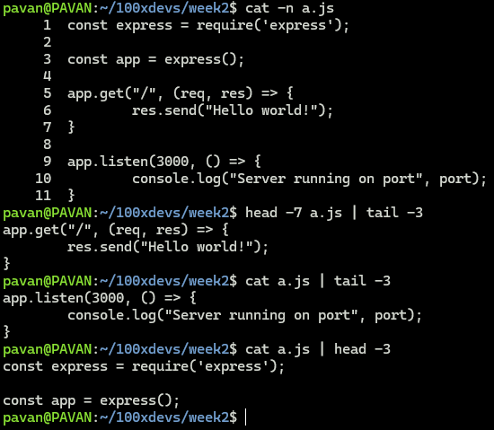

## **`grep`**

`grep` is a command used to find patterns in a file, i.e., to match regular expressions or patters in the contents of the file.

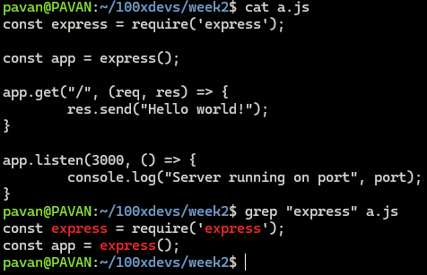

`grep` is often used in conjunction with other commands, with the help of the pipe operator. One such example is the `wc` command that gives the line count (\n is used to find no: of lines), word count ( space is used to delimit words => non-space-separated sequence of characters is a word) and byte count.

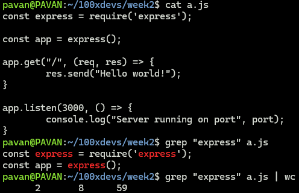

**`-c`**: gives just the count of occurences of pattern

**`-i`**: "case in-sensitivity" while matching pattern i.e., doesn't care about casing while matching patterns

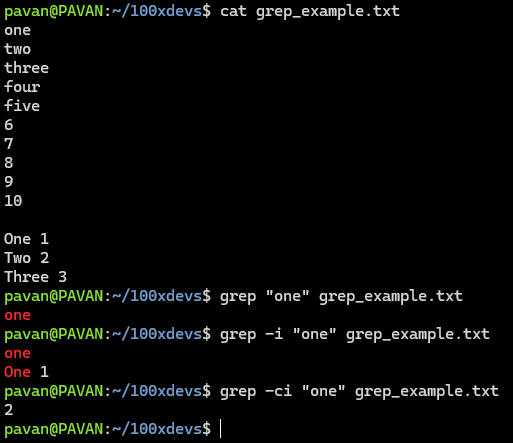

**`-n`**: gives line numbers also where the matching patterns were found

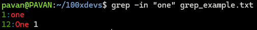

**`-w`**: matches pattern only where it is by itself, and not part of any word i.e., the pattern must not be somewhere in between some words.

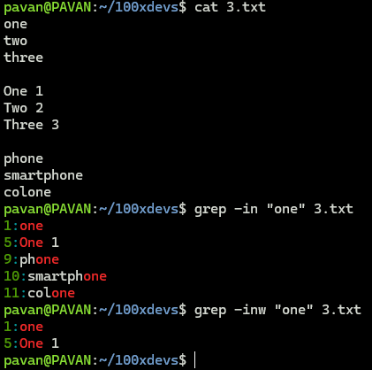

## **Bash** scripts

Bash is not just used for giving commands in the bash shell, but is a language, or rather a "scripting language" using which scripts can be written to automate some tasks when run.

Every bash script starts with the line `#!/bin/bash`

Example bash script:

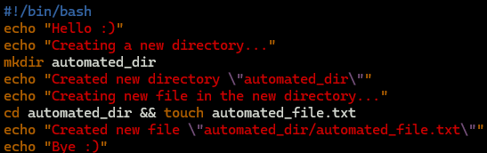

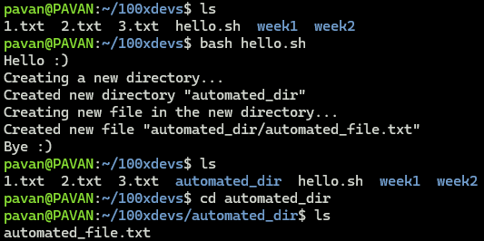

## **`grep`**, **`sed`** and **`awk`**

### **`grep`** (more applications)

Let's take an example of parsing a logfile. Generally we only want to see the lines where the "ERROR" has occured. This can be done using **`grep "ERROR" log.txt`**. In some cases, we want to see other messages also but not any of the "INFO" ones. This can be done using the **`-v`** flag, that omits the lines where the patterns were matched (reverse functionality)

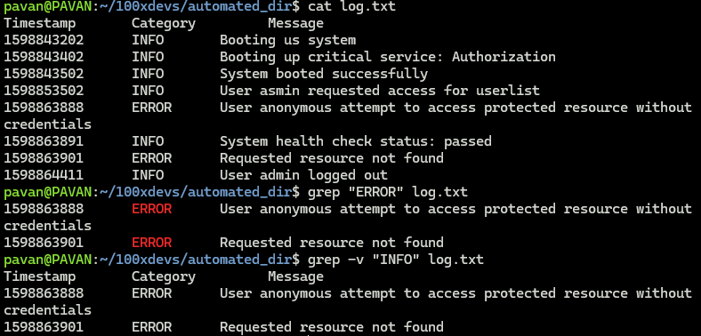

If we want to check some lines before and after the line where the pattern was matched, we can use the **`-A`** and **`-B`** flags respectively. **`-C`** gives for both before and after .

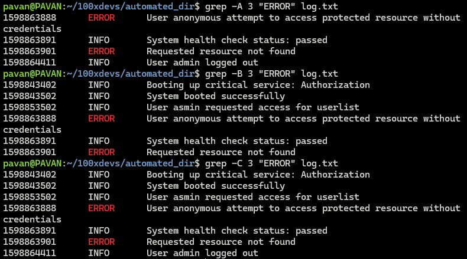

<hr>

### **`sed`**: stands for stream editor

**`sed`** can do everything than **`grep`** can do, and also more than that.
It has 3 parts to it `sed 'operation/pattern/replacement/ option' file.txt`.

First let's try to replicate **`grep`**, by filtering out the "ERROR" messages.

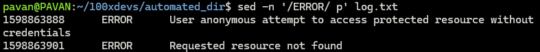

The **operation** and **replacement** fields are empty as we don't need those. There is a `p` at the end that says to just print the lines. **`-n`** flag is used to just extract the matched lines and not all the lines.

To substitute some data in the file, we can use the **`s`** operation for "substitute", and specify a replacement. This will just replace the data and display it but not modify the actual contents of the file.


We can create a backup to not alter the original file by mistake (it is possible to change file in-place, hence this option exists), by using the **`ibackup`** flag.

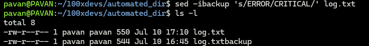

We can also choose where we want the substitution to happen (or else all matched patterns will be substituted)

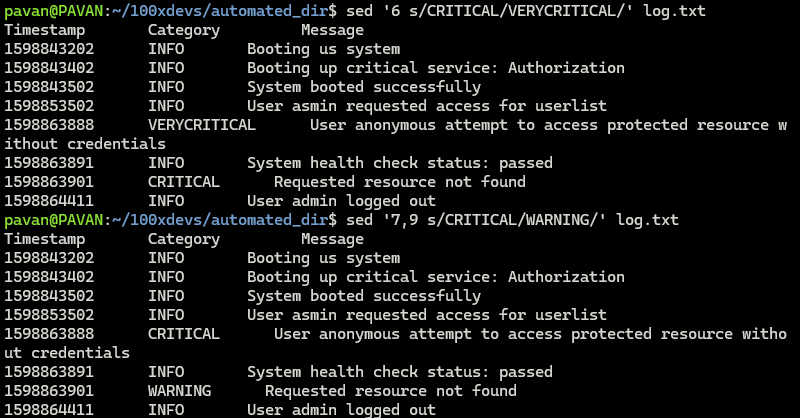

<hr>

### **`awk`**: most powerful text processing cli tool in linux

**`awk`** in itself is a scripting language. It is used like **`awk [OPTIONS] script file`** and patterns are defined as **`(pattern){action}`**

Again, first we will try to replicate the functionality of the `grep` command.

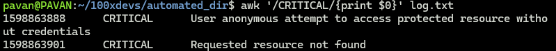

We can also subtitute data like how with **`sed`**.

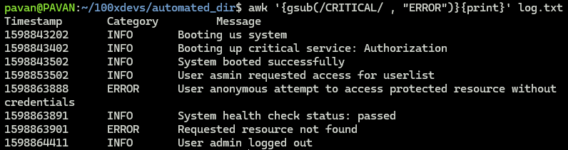

Also, we can add some lines at the beginning (header) and at the end (footer).

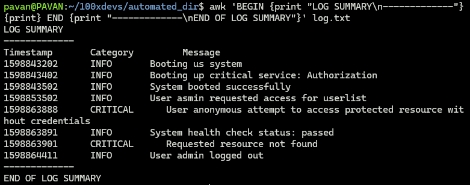

We can select columns from our data, when they are structured in a columnar way like out log file. It used spaces to seperate out columns (1 word is considered as a column)

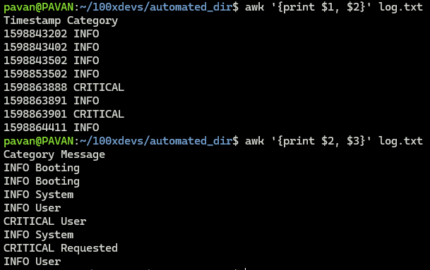

To specify the delimiter to use instead of whitespace as in the above example, the **`-F`** flag can be used like **`awk -F "delimiter" '{print $1, $2, ...}' <filename>`**

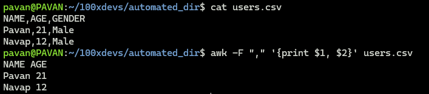

We can also perform arithmetic operations on the file content. In our log file, we can count the number of times an critical error has occured using the 2nd column ($2).

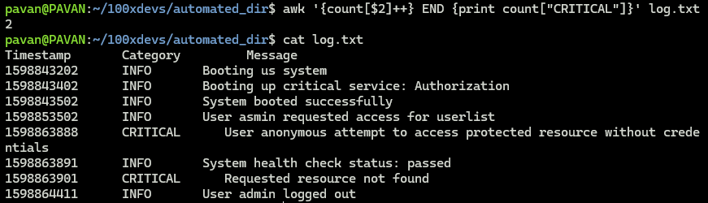

Also, we can specify a condition like to show all lines that are after some specific timestamp.

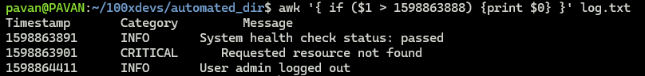

# **_Week 2.5_** : Express with example

### check `express-class` folder

# **_Week 2.6_** : `filter`, `map` and arrow functions

## arrow function

```js
// NORMAL FUNCTION DEFINITION
function sumNorm(a, b) {
  return a + b;
}

// ARROW FUNCTION DEFINIITON
const sumArr = (a, b) => {
  return a + b;
};

console.log(sumNorm(1, 2)); // 3
console.log(sumArr(1, 2)); // 3
```

Both types of funtions are called and used in the same way, but the definition syntax is different.

## `map` function

Used when we need to apply some operation to all the elements in an array. This can be done using just for loop, but it becomes inefficient when the operations are more complex.

```js
// simple operation of multiplying all element by 2
let arr = [1, 2, 3, 4, 5];
let newArr = [];

for (let i = 0; i < input.length; i++) {
  newArr.push(input[i] * 2);
}

arr = newArr;
console.log(arr); // [2,4,6,8,10]
```

Given an **_initial `array`_** as input and a **_transformation `function`_**, the **`map`** function takes each element of the **given array** and applies the **transformation function** to each of the elements and returns the **_transformed `array`_**.

**Syntax: `arr.map(`_`f`_`)` or `arr.map(function(ele) {...})` or `arr.map((ele) => {...})`**

```js
// transformation function
function transformation(num) {
  return num * 2; // transformation
}

// initial array
let arr = [1, 2, 3, 4, 5];
arr = arr.map(transformation);

// or use function within map
arr = arr.map((ele) => {
  return ele * 2;
});
arr = arr.map((ele) => ele * 2); // when only 1 return stmt there inside function

// transformed array
console.log(arr); // [2,4,6,8,10]
```

## `filter` function

Used when needed to "filter" an array i.e., need to extract specific elements from an array. This can be done using just for loop, but it is inefficient.

```js
// simple operation of getting even number
let arr = [1, 2, 3, 4, 5, 6];
let newArr = [];

for (let i = 0; i < input.length; i++) {
  if (input[i] % 2 === 0) {
    newArr.push(input[i]);
  }
}

arr = newArr;
console.log(arr); // [2,4,6]
```

Given an **_initial `array`_** as input and a **_filtering logic_**, the **`filter`** function takes each element of the **given array** and applies the **filtering logic** to each of the element and returns _`true`_ or _`false`_ which is used to determine if that element will be included in the final **filtered `array`** or not.

```js
// initial array
let arr = [1, 2, 3, 4, 5, 6];

// filtering logic
function filterLogic(num) {
  if (n % 2 === 0) return true;
  return false;
}

// or use function within filter
arr = arr.filter(function (n) {
  if (n % 2 === 0) return true;
  return false;
});

// filtered array
arr = arr.filter(filterLogic); // [2,4,6]
```


# **_Week 2.7_** : Git and GitHub
## Version Control System (VCS):
- keeps **track** of files and projects
- allows to **revert** selected files or entire project to previous state, **compare changes** over time, see who **modified** what files and at what time to find out whose changes caused an **issue**.

There are 2 types of VCS: **Centralized** and **Distributes**
### Centralized: central server used to store, manage and access the code.
Ex: Apache Subversion, Team foundation server

**Single Point of Failure**: The central server that stored the current stable version of the code also known as the **Main Trunk** has to always be available. This can be a drawback that if the central server is down then code cannot be accessed at all and this disrupts all operations.


As seen the above example, everyone is making changes to the main trunk and when the main trunk is unavailable, no one can do anything.

### Distributed VCS: removing central access and distribute control among all collaborators
Each participant / collaborator has their own copy independant of the main trunk thus allowing each one to work independantly and later merge the copies into the main trunk to keep the main trunk updated. This means that everyone has a "mirrored" copy of the main trunk.

Ex: Git, Mercurial


This removes the **Single point of failure** as if the main trunk ever goes down, we can get the updates from another particiapnt's copy. This also means that the server need not always be online, as an individual keeps pushing their updated code ti thei local copy and all thse local copies are merged later to keep the main trunk up-to-date.

**_Git_: free and open source VCS**
Advantages: Free, Open source, Scalable, Fast, Cheap/Inexpensive branching and merging

## GitHub
GitHub is a web-based hosting service for git repositories (code repository).

> **Git** can be used without **GitHub**, but **GitHub** can't be used without **Git**

| **Git** | **GitHub** |
|:-------:|:----------:|
| used for version control | used for hosting git repositories|
| locally installed | cloud based |
| tracks file changes | web interface to view file changes |

### Terminology
| **Term** | **Description** |
|:--------:|-----------------|
| **Local Repository** | private copy of the entire repository |
| **Working Directory / Staging Area / Index** | intermediate area where commits can be reviewed and formatted before completing commit |
| **`push`** | send or upload changes to the repository |
| **`pull`** | retrieve or get changes from the repository |
| **BLOB** (**B**inary **L**arge **OB**ject) | Every version of a file is represented as a _`blob`_. A  _`blob`_ holds filedata but doesn't contain any metadata about the file. It is a binary file and stored in the Git database as a _**SHA1 hash**_ of the file. This _SHA1 hash_ is used to address the file uniquely (Git uses _content-addressing_ not _filename-addressing_) |
| **Trees** | Tree is an Object, that represents a `directory`. It holds `blobs` and other sub-directories. A tree is a binary file that stores _references to blobs_ and trees are also named as _**SHA1 hash**_ of the tree object. |
| **Commits** | A **Commit** holds the current state of the repository and is also named by the _**SHA1 hash**_. All the commits form a _linked list_ i.e., a _commit_ is like a **node of the linked list**. This helps to treverse back the _**commit history**_ using the _parent commit_. If a singular commit has **2 parent commits** => formed by **_merging_ 2 branches**. |

Steps of working with **Git**:
- Modify files in the `working directory`
- Stage the changes using `git add` (working directory ---> staging area)
- Commit changes using `git commit` (staging area ---> repository)
- Push the changes to permanently add the commit, using `git push`

### Git commands
| **Command** | **Syntax** | **Description** |
|:-----------:|------------|-----------------|
| Clone | `git clone <github-repository-URL>` | Download a repository hosted on GitHub into the local machine / folder |
| Add | `git add <files-to-track>` | Track files and changes in Git |
| Commit | `git commit -m "<commit-message>"` | Save file changes to the local repository in Git |
| Push | `git push <branch>` | Upload commits to git repo, like GitHub |
| Pull | `git pull <branch>` | Download any changes made to the git repo (remote repository) to local repository |

#### `git init` : Initialize empty repository
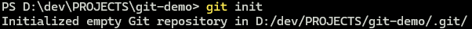

#### `git status` : check status (staged or unstaged) of files
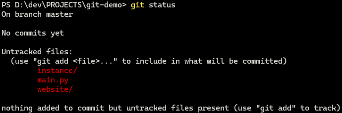

#### `git add`
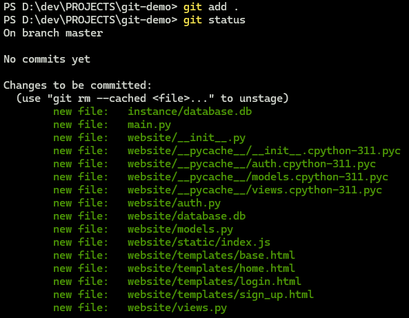

#### `git rm` : unstage a staged file (`-r` flag for unstaging folder and it's contents)
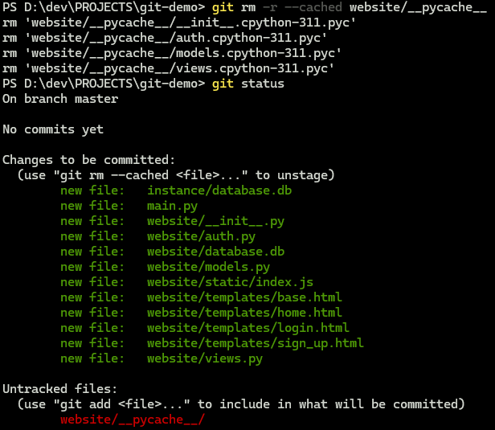

#### `git commit`
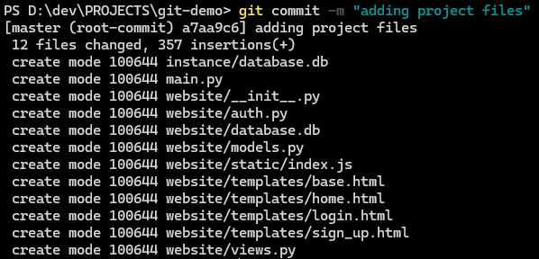

At this point, we have created a local repository in Git and committed all the files into the local repository. Next we need to connect the GitHub repository (remote repository) to our local Git repository.

#### `git remote` : connect remote GitHub repository to local Git repository
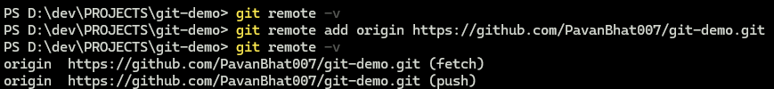

Now we can `pull` (fetch) and `push` code from and to the GitHub repository. Both are denoted by the word **`origin`**.

#### `git push` : upload and save the file changes of the commits to the GitHub repository
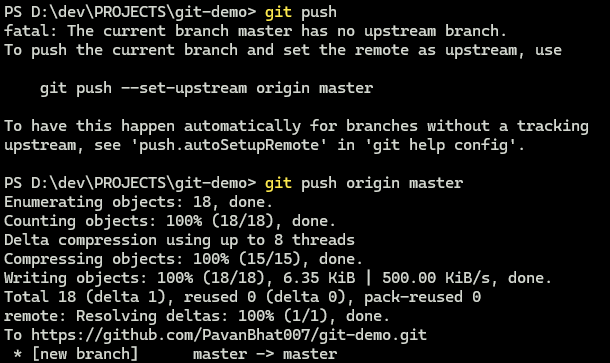

Initially it didn't know where to push it to, so by adding the **`origin master`** we are saying use the URL in **`origin`** (previously added with the **`git remote add`** command) and push it the **`master`** or main branch.

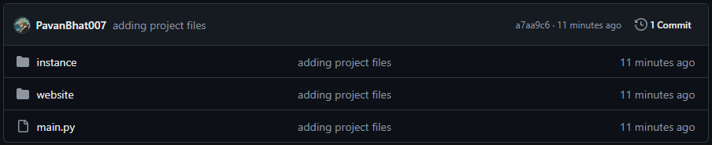

We can see that the commits have been "pushed" and are saved in the GitHub repository.

Until now, we created a **GitHub** repo and pushed our local repo's code to it, but generally, this is not the right way or is the less efficient way to work with **GitHub**. Generally, we **`clone`** the empty **GitHub** repo first then add the files and then push the changes. When we clone the repository, we not only get all the code (if present) but also the **git** configuration, commit history, working directory history, etc that make it easier to work with **git**.

> I will delete all the files from my local machine and clone it newly for demonstration purposes.

#### `git clone`
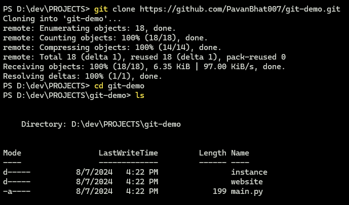

Now it is the same as what we have done before. We can stage files, commit changes and push the commits to the GitHub repo directly without having to set the remote URL, because they are added automatically as we have cloned the GitHub repo itself whcih removes the need to create a local Git repo and connecting it to the remote GitHub repo.

### Branches and Merging
Branches are used to create an independant copy of the repo so that the changes committed to the branch don't affect the master branch (likely having production ready code). Once the feature in the branch is completed and tested, it can be "merged" with the master branch to integrate that feature.

#### `git branch` : view branches and used to find out which branch are we currently on
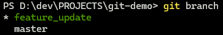

The * indicated which is the branch we are currently using or are on.

#### `git checkout <branch>` : used to switch to another branch (-b flag creates a new branch)
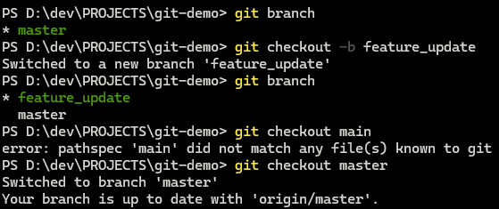

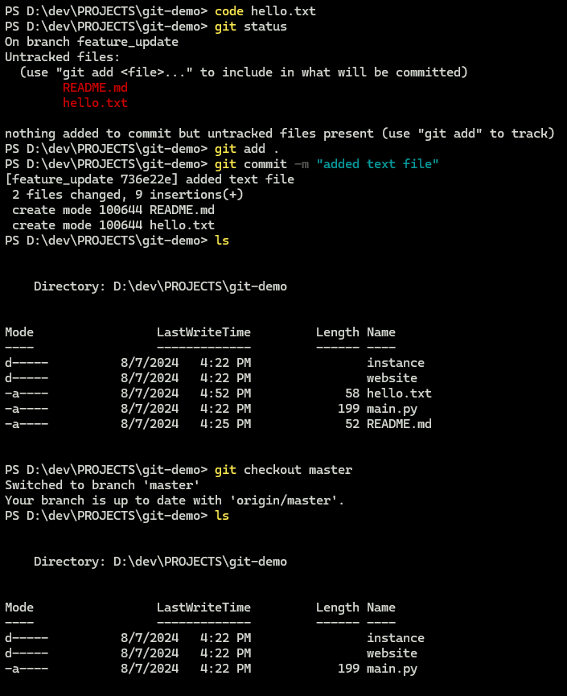

We can see that the changes committed on the `feature_update` branch are not available in the `master` branch. To get the changes upadted on the `master` branch, we need to merge the branches.

#### `git diff <branch>` : check the "difference" between current branch and another branch
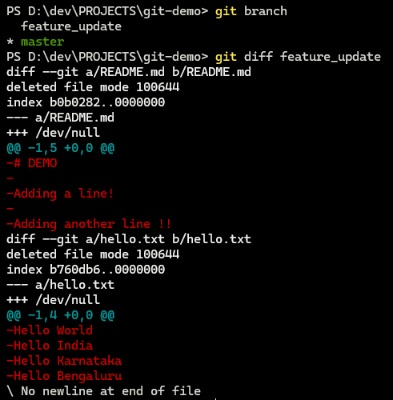

We can just directly merge here, but this is not advisable as it may cause some problems if there was something wrong with the code. So, first we push the code to the branch and then make use of "pull requests".

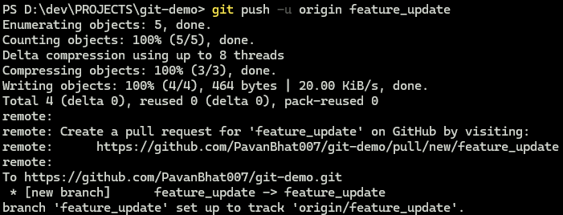

We can create a Pull Request(PR) using GitHub's web UI. It shows from which branch to which branch the PR will be created and also check for any conflicts. One PR can have many commits i.e., until the feature is not completed, the PR will be open and all the commits done on the `feature_update` branch wil be appended to the PR.
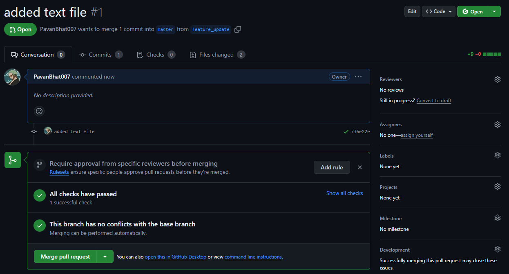

So, when it is time to merge the branches, we can just merge the PR, which will bring all the changes of the `feature_update` branch to main/master branch. The commits on the branch will be added to the master branch commits and can be seen in the commit history.
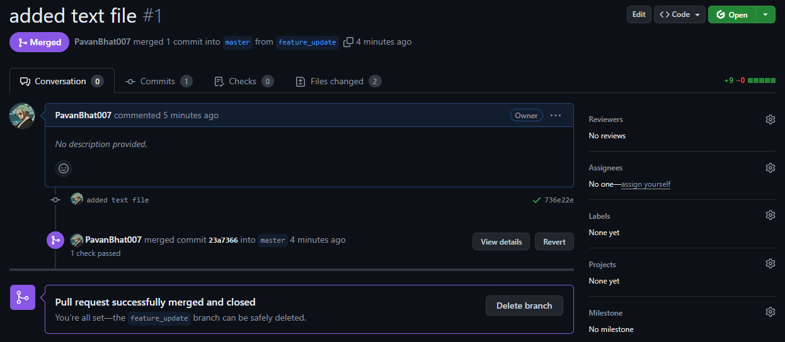

Once the branch is no more needed, as the code has been merged it becomes just another redundant copy, we can delete the branch. For this we can use the `-d` flag for the `git branch` to delete the branch. Also the branch can't be deleted if we are on it => we need to checkout to differebt branch before doing so.


In real-world, this will not be as simple as it may seem. There will be many people creating branches, merging branches whcih will not always be reflected in all the branches. So, at times where a commit on the main branch has a file change that is different from the change on a branch trying to be merged i.e., the branch's code and the main's code of the same file are different, it causes a _**merge conflict**_ as git doesn't know whcih is the code to be kept (main's or branch's).


In the above image there is a C4 commit on master, that is not there in the feature branch. If the C4 commit and the feature branch's commits haven't done changes to the same file (conflicting changes), the merge is done successfully, else a merge conflict arises that must be resolved manually.

Naturally, git has a way or warning the user saying that there are changes on the master branch that are not available in the branch, which might lead to merge conflicts.

#### Git commands to resolve conflicts
| **Command** | **Description** |
|:-----------:|-----------------|
| **`git log --merge`** | gives list of commits that are causing the conflicts |
| **`git diff`** | tells differences between states of repository and files |
| **`git checkout`** | undo changes made to a file, or to change branches |
| **`git reset --mixed`** | undo changes to working directory, and staging area |
| **`git merge --abort`** | exit merge process and revert to state before the merging process began |
| **`git reset`** | reset conflicted files to previous state |


Both the branches `master` and `hotfix` have made changes to the same `README.md` file, which is causing the conflict.

Easiest way is to manually edit the files causing conflict and resolve the conflict. Git automatically add the seperators and branch headings to that we can know what are the exact parts of the file causing conflict. Remove the additionally added branch names and seperators and make the changes to the file, and commit the changes.

