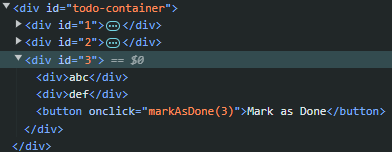
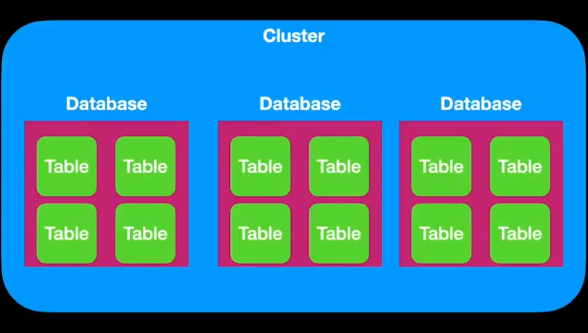

# **_Week 4.1_: Basic Front-end, DOM, Dynamic Front-ends and Connecting to Back-end**

## **DOM**

> DOM already covered in previous week, this section will have only missed out or some important details from this week's session

**`onChange`** attribute on input element gets triggered when the input element is out of focus, but the attribute **`oninput`** is triggered as the user is typing so it is more "real-time"

## **Throttling or Debouncing**

For instannces where there are input fields that trigger and send request to some backend server using **`oninput`**, this will send a request for every change in the input field, which can be a large number based on the user interactions.

A solution is that the user will enter the input completely at once by copy pasting and not typing, but this is not a natural user behaviour.

**Solution**: Debouncing

Here the requests are not sent immediately as the user is typing. We wait for a period like 100ms where the user hasn't typed i.e., the input inteneded is complete and after that only send 1 request.

```js
let timeout;
function debouncedSum() {
  // if called while waiting the 100ms,
  // stop the clock and restart it
  clearTimeout(timeout);
  timeout = setTimeout(() => {
    calcSum();
  }, 100);
}
```

The above function is the given as the function for **`oninput`**, so now the backend call to calculate sum is being "debounced" and called fewer times, thus saving the number of backend calls.

When the **`debouncedSum()`** is called for the first time, it starts a timer for 100ms. If there is another call before the previous timer of 100ms hasn't yet been completed, it clears the previous timer and starts a new 100ms timer. Thus this approach waits for the user to completely stop typing for 100ms after which the backend **`calcSum()`** is called.

# **_Week 4.2_: React JS Foundation**

DOM Manipulation using the primitives provided is hard and time-consuming for for dynamic websites. That's why frameworks like React, Vue, etc were introduced.

## **DOM Manipulation primitives**

| Function | Description | Example |
|----------|:-----------:|---------|
| **`document.createElement(<element>)`** | Create a required HTML element | **`const div = document.createElement('div')`** <br/> The method returns the HTML element.|
| **`parent.appendChild(<child>)`**  | It is a method on an HTML element (parent) to append another HTML element to it. | **`div.appendChild(document.createElement('p'))`** <br/> Here we are creating a `<p>` element and appending it to the `<div>`. So, the div's body (innerHTML) will get the `<p>` at the end. |
| **`parent.children`** | `children` is a property of the parent HTML element, which is bascially a list/array of it's children | **`div.children[0].innerHTML = 'Hello World!'`** <br/> Here the first child (0th -> first) is accessed via the `.children[0]` and it's value is changed. |
| **`element.setAttribute(<attribute>, <value>)`** | It is used to add specific attributes like id, class, onclick, etc on the element | **`p.setAttribute(id, 'first-child') |

> Example

```js
const div = document.createElement("div");
const p = document.createElement("p");

div.appendChild(p);
div.children[0].innerHTML = "Hello World!!";

div.children[0].setAttribute(
  "onclick",
  "function clicked() { p.innerHTML = 'clicked'; }"
); // or p.setAttribute()
```

Below is the script part of the TO-DO example:

```js
let globalId = 1;

// able to access a todo via the ID because it is set while creating the child
function markAsDone(todoId) {
  const parent = document.getElementById(todoId);
  parent.children[2].innerHTML = "Done"; // accessing the button
}

function createChild(title, desc, id) {
  // creating all the required elements
  const child = document.createElement("div");
  const firstGrandCild = document.createElement("div");
  const secondGrandChild = document.createElement("div");
  const thirdGrandChild = document.createElement("button");

  // updating the values of the elements
  firstGrandCild.innerHTML = title;
  secondGrandChild.innerHTML = desc;
  thirdGrandChild.innerHTML = "Mark as Done";

  // onclick requires a function inside a string/ string template
  thirdGrandChild.setAttribute("onclick", `markAsDone(${id})`);

  // appending all the children
  child.appendChild(firstGrandCild);
  child.appendChild(secondGrandChild);
  child.appendChild(thirdGrandChild);
  child.setAttribute("id", id); // "1", "2", ... ID's are set on the child
  return child;
}
```



Problems with the above approach:
1. **Difficult to add and remove elements**: The process of adding and removing elements becomes intricate with the existing setup. Direct manipulation of the DOM for such operations can lead to _complex and error-prone code_.
2. **Lack of central state**: Each function having it's own state and no centralized state management makes it difficult to maintain _consistency_.
3. **Integration with server**: Handling data sent from external server requires more _organized and seamless approach_.
4. **Mobile app updates**: The _absence of updating and removing logic_ for todos limits flexibility and robstness of the application.

## State

It is the data that changes over time within a component or application, influencing what the user sees and how they interact with it. It is like the memory of the application and changes dynamically.

> So, the "**state**" of a React application is the collection of all the **dynamic data** that determines its current appearance and behavior.

The above example of a To-Do app is very primitive and becomes difficult to code like that for large application and for scenarios where a list of todos (state) are sent from a server and they need to be updated. So, we need to create a script where it can take a state as an input and apprpriately update the DOM.

With React, it just needs the state and the logic, and it does all the heavy-lifting of rendering the parent, children, appending, etc. Below is a dynamic version that tries to simulate working of React.

```js
function createChild(title, desc, id) { /* ... */ }

// This and above rendering is taken care by React
function updateDomAccordingToState(state) {
  const parent = document.getElementById("todo-container");
  parent.innerHTML = "";

  state.forEach((todo) => {
    const child = createChild(todo.title, todo.desc, todo.id);
    parent.appendChild(child);
  });
}

// This is the only part we need to care about now
window.setInterval(async function () {
  const res = await fetch("https://sum-server.100xdevs.com/todos");
  const state = await res.json();
  updateDomAccordingToState(state);
}, 5000);
```

This way is not the most optimal way because we are entirely clearing the DOM and appending all the elements, and if the server returns the same set of todos, it clears and appends same thing. Better way is to calculate the difference between current state and the state sent by the server and update the required elements only.

For comparing and calculating the difference, we need a way to store the current state in a variable -> Virtual DOM.

Virtual DOM is a lightweight copy of the DOM.

Easiest way to create the dynamic website:
1. **Update the state variable** -> *done by developer or user interactions*
2. **Delegate the task of figuring out the diff. to a hefty function** -> *done by React*
3. **Tell hefty function how to add, update and remove elements** -> *done by React-DOM (library to manipulate DOM using React)*
> **Hefty function will be called again and again with the updated state, to update the DOM dynamically.**

<br/><br/>

So in the context of the todo application: 
1. **State Changes**: updating or removing of todos from the backend.
2. **Virtual DOM Comparison**: the new state is used to create a Virtual DOM and compared with the previous Virtual DOM.
3. **Identifying the changes**: finding the "diff" between the new and the old Virtual DOMs.
4. **Efficient Updates**: instead of clearing the entire parent element and re-rendering everything, the Virtual DOM helps identify specifically what has changed.
5. **Selective DOM Manipulation**: only changed elements are modified in the actual DOM.

> ***By employing a Virtual DOM, React optimizes the process of updating the actual DOM, leading to better performance and a smoother user experience. This mechanism is a key feature of React and contributes to its popularity for building dynamic and responsive web applications.***


## **React**

**Vite** is a npm library that creates a boiler-plate for any selected frameworks (in our case React app).

The **`src`** folder in the app created by Vite contains an **`App.jsx`** and **`main.jsx`**.
- **`main.jsx`** creates the root or the DOM for the application, which is present in an **`index.html`** file.
- **`App.jsx`** is the initial point of the application where we make a function that returns some HTML which will be dynamically placed into the  **`index.html`** by React.

**React** is a diff calculator and **React DOM** -> DOM manipulator
> User/ Dev -> React -> React DOM

A .jsx file contains a React Component that returns essentially HTML. This HTML code is embedded with JavaScript using curly braces.
- {variable} -> to display any JS variable
- { ... } -> can have entire JS code encapsulated within the braces

```jsx
let count = 1; // JS variable

// () => {} creates an anonymous function
// that runs immediately when the event is trigerred
// {count} displays the count variable's value
<button onclick = {() => setCount((count) => count + 1)}> 
  Count is {count}
</button>
```

# **_Week 4.3_: Mongo Deep Dive**

> **Database**: place where data is stored persistently i.e., *Servers are transient* (keep changing) but *database is persistent* (permanent and must be very secure)

Intermediate server between DB and user is required because:
- DB protocols are difficult to be understood by browsers
- DB doesn't have granual access as a first class citizen i.e, difficult to to perform single user specific access (if user has access => they access entire database and to perform action specially for the single user is very hard). Hence the express server having full access to the DB,will to the auth check and perform the operations.

Some servers like ***Firebase*** provide ability to get rid of the intermediate server and try their best to provide granual access. These DBs are called a "***server-less databases***".

DB primitives (CRUD):
1. Create -> add/ create new data
2. Read -> get some data
3. Update -> change existing data
4. Delete -> remove existing data

## Mongoose
It is a library that allows us to talk with the Mongo database, called as an ORM (Object Relational Mapper).

**Schema**: **structure of the data** that will be added in the database. **SQL** uses schemas and **noSQL** DBs are "_schema-less_"

### 0. Define Schema and the models
Mongoose requires us to first define the "**Schema**". Even though MongoDB is "**schema-less**", mongoose requires it for _auto-completion, validating data before sending to DB_. This is done because schema-less DBs can be very dangerous and usage of schema in mongo slightly reduces the risk.

Definind Schema in **`mongoose`**:
```js
const UserSchema = new mongoose.Schema({
  email: String,
  password: String,
  username: String,

  // array of Course objects
  purchasedCourses: [
    {
      // MongoDB adds a randomly generated ID on each object
      // So, every course will have it's own unique ID
      type: mongoose.Schema.Types.ObjectId,
      ref: 'Course' // way to create relationships
      // here we are relating the User to Course(s)
    }
  ]
});

const CourseSchema = new mongoose.Schema({
  title: String,
  price: Number
})
```

The way to relate 2 schemas in mongo is to create an array with "***references***".

To define the model, or initialize the tables (folders):
```js
const User = mongoose.model('User', UserSchema);
const Course = mongoose.model('Course', CourseSchema);
```

The "**model**" object is what allows us to perform CRUD operations on the database.

### 1. Create

**`.create()`** is the method for creating/ inserting data into the DB
```js
// model.create({ ... })
User.create({
  // attributes and values
  username: req.body.username,
  password: req.body.password
});
```

### 2. Read

**`findOne({ <search-parameters> })`**, **`find({ <search-parameters> })`** and **`findById(<id>)`** allow to get/ retrieve data from the database using some specific value or ID. There are more of such methods, but these are the most commonly used.
```js
User.findById("1"); // returns the unique single user

// returns only the first occurance of
// users that satisfy the filter
User.findOne({ username: "pavan" });
// returns all the users that satisfy the filter
User.find({ username: "pavan" });
```

### 3. Update

Similar to Read, there are **`updateOne()`**, **`update()`** methods that is used to update single entry.
```js
// model.updateOne( <filter>, <update> )
User.updateOne(
  { "id": "1" }, // to identify the entry to update

  // $push is a db operation that pushes to an array
  { $push: { purchasedCourses: courseId }}
);

// updateOne updates the first occuring record only
User.updateOne(
  { "id": "2" },
  { "password": "new-password" }
);

// update all occurances
// here there is no id filter so
// the update is applied to all users
User.update({}, {
  permium: true
});
```

### 4. Delete

To remove entries from the database, **`deleteMany(<filter>)`** and **`deleteOne(<filter>)`** methods exist
```js
User.deleteMany({}) // empty filter -> clears entire db

// removes first occuring entry where username = "pavan"
User.deleteOne({
  username: "pavan"
});
```

There are much more APIs/ methods for different types of operations but the above methods suffice for common day-to-day DB operations.

## 3 Jargons in Databases

**Cluster**

Machine/ VM that holds and runs multiple databases. Every database bight be used for some different types of applications but they are all hosted and running within the "***cluster***".

**Database**

Database is a persistent storage of data, that is used by applications to store and retrieve data efficiently.

**Table**

Represents an entity in the Database, where specific type of data is stored. Ex: Users table stores userdata and Courses table stores data related to courses offered.

> ***Many tables exists in a Database, and Many Databases can exist in a Cluster.***



### Refer [Week 3 Mongo Assignment](https://github.com/PavanBhat007/100xdevs-assignments/tree/master/week-3/03-mongo) for example