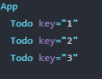
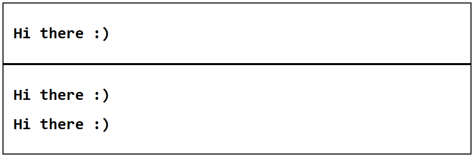
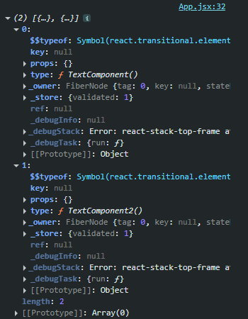

# _**Week 6.1: React Deeper Dive**_

> React returns, re-rendering, keys, wrapper components, useEffect, useMemo, useCallback, useRef

### React component returns

A React component can only return single top-level element, not able to return multiple sibling elements. If trying to return multiple element, React throws an error saying "JSX expressions must have only one parent". So we need keep the child elements into one extra container (dvi), but if we dont want to have an extra element, an empty tag (called as a 'fragment') can also be used (or use React.Fragment).

This is because it becomes **easier for re-conciliation** (determine the diff and re-render DOM).

```jsx
import React from 'react';

function App() {
  return (
    <>
      <Header title="Home" />
      <Header title="About" />
    </>
  )
}

function App() {
  return (
    <React.Fragment>
      <Header title="Home" />
      <Header title="About" />
    </React.Fragment>
  )
}
```

### Re-rendering of DOM

Whenever we append an element, remove an element or update an element within the DOM, it triggers a **_'re-render'_**. The action that trigerred the update is not called as re-render, but the logic that runs in the back, to update the DOM element and change the DOM adynamically is called the re-render.

When creating dynamic websites (with React), the goal is to minimize the number or re-renders. This might not pose a problem for small applications but for larger applications or mobile apps, the re-renders have to be minimized to optimize performance.

If there are 2 components, one that changes dynamically, and another that is static; the update in the first component re-renders the first component (_of course_), but with it also re-renders the second static component and the top level **`App`** component as well.

**A re-render means that:**

- React calculated the "diff" (what should be updated in the component)
- component gets "called" (essentially a component is a function that returns JSX, and it gets called during re-render)

**A re-render happens when:**

- **state variable that is being used inside the component changes/updates**
- **parent component re-render triggers all children component re-rendering**

How to minimize the re-renders?

1. **Push the state down to children components**: Instead of having the state variables used but child component defined in the parent, make a _custom child component_ and define the state variable there. This way, only the _"custom child component"_ re-renders and other sibling component (static components) don't re-render.

    ```jsx
    // Header component will not re-render here
    // Only App and CustomHeaderWithBtn re-renders
    function App() {
    return (
        <>
        <CustomHeaderWithBtn title="Home" />
        <Header title="About" />
        </>
    );
    }

    // custom child component to minimize re-renders
    function CustomHeaderWithBtn() {
    const [title, setTitle] = useState("Title");
    const updateTitle = () => setTitle(Math.random());

    return (
        <>
        <button onClick={() => updateTitle()}>
            Click me to change the title
        </button>
        <h1>{title}</h1>
        </>
    );
    }

    export default App;

    ```

2. **Memoization** ([React Memo](https://react.dev/reference/react/memo))

    **`memo`** allows us to skip re-rendering a component when its props are unchanged.

    To use React **`memo`**, we have to wrap the entire component within the **`memo()`** method call.

    ```jsx
    import { memo } from 'react';

    // wrapping the component within memo()
    const MemoHeader = memo(({ title }) => {
        return (
            <div>
                <h1>{ title }</h1>
            </div>
        );
    });
    ```

If the memo child components are wrapped in a _'fragment'_, it still ends up re-rendering all, so should use something like a `div` for the parent HTML element.

```jsx
function App() {
  // re-renders all MemoHeaders
  return (
    <>
      <MemoHeader title={abc}/>
      <MemoHeader />
      <MemoHeader />
    </>
  )
}

function App() {
  // re-renders only first MemoHeader
  return (
    <div>
      <MemoHeader title={abc}/>
      <MemoHeader />
      <MemoHeader />
    </div>
  )
}
```

### Keys in React

When using arrays in state variables, there will be an error _`"Each child should have a unique key prop"`_ shown in the console. We need to provide each element in an array with a unique key (string or a number) that helps React identify it among other list items. This is required when the array itself is dynamic and elements can be added/removed from the array.

```jsx
{todos.map((todo) => (
    <Todo 
        key={todo.id}
        title={todo.title} 
        description={todo.description} 
    />
)}
```

When each list item has keys, this is how it looks in the Component viewer (React devtools)



### Wrapper Components

A wrapper component is a React component that takes another React component as input. It can be used like **`<WrapperComponent innerComponent={<Component />} />`**

```jsx
// top level app component can render the wrapper 
// each taking another component as input
function App() {
    return (
        <CardWrapper innerComponent={<TextComponent />} />
        <CardWrapper innerComponent={<TextComponent2 />} />
    )
}

function TextComponent() {
  return <h1>Hi there :)</h1>;
}

function TextComponent2() {
  return (
    <>
      <h1>Hi there :)</h1>
      <h1>Hi there :)</h1>
    </>
  );
}

// Wrapper component
function CardWrapper({ innerComponent }) {
 // defining common style for all rendered components
  return (
    <div style={{ border: "2px solid black", padding: 20 }}>
        {innerComponent}
    </div>
  )
}
```



Both the rendered components are different but they have the same wrapper component. Using the wrapper component, we can define specific styles for each of the components and need not repeat the style within the components itself each time.

This way works fine but is not used normally. The proper way to create a Wrapper and user it:

```jsx
function App() {
    return (
        <>
            <CardWrapper> <TextComponent /> </CardWrapper>
            <CardWrapper> <TextComponent2 /> </CardWrapper>
        </>
    )
}

function TextComponent() { /* ... */ }
function TextComponent2() { /* ... */ }

// Wrapper component has access to a prop called as 'children'
// this contains all the elements/components that are present
// within the Wrapper component in the App component
function CardWrapper({ children }) {
 // defining common style for all rendered components
  return (
    <div style={{ border: "2px solid black", padding: 20 }}>
        { children }
    </div>
  )
}
```

The **children** prop is an array of the components present within the Wrapper component.



## React Hooks

Hooks in React are functions that allow us to "hook into" the React state and lifecycle features from function components.

Ex: useState, useEffect, useCallback, useMemo, useRef, useReducer, useContext, useLayoutEffect

### useEffect

Previously, we had seen in the Todo app that directly fetching in the App component caused the app to go into an infinite loop of fetching data -> updating state -> re-rendering -> fetching data ...

To tackle this **`useEffect()`** hook can be used. It allows us to "hook into" the **mount, unmount and render** lifecycle events. We can set it to run specific code (fetching) to run when the component is mounted or unmounted or rendered.

The syntax is like: **`useEffect(func(), [dependancy array])`**

```jsx
function App() {
    // empty dep. array => run on first mount only
    useEffect(() => {
        fetch(URL).then(() => { /*... */ })
    }, [])

    // we can add state variabled in thedep. array so that
    // the specific code runs when that state variable is updated
    const [todos, setTodos] = useState([])
    useEffect(() => {
        fetch(URL).then(async (res) => {
            const json = await res.json();
            setTodos(json); // updating state variable
        })
    }, [todos])

}
```

_**Note: `useEffect(() => {}, [])` i.e., when mounted, it actually runs twice. Wihtout the [], it becomes an infinite loop and keeps running the code inside the useEffect**_

Also, we cannot add an async function as the first argument in **`useEffect`**. It can be used to poll a backend server periodically to refresh some list.

```jsx
useEffect(() => {
  setInterval(() => {
    fetch("http://localhost:8080/todos")
      .then(async (res) => {
        const data = await res.json();
        setTodos(data.todos);
    });
  }, 10000); // 10s interval
}, []);
```

# _**Week 6.2: Common hooks in React**_

**Side effects**: operations that reach outside the functional scope of React components. These operations can affect other components, interact with the browser, or perform asynchronous data fetching.

Ex: **`setTimeout`**, **`setInterval`**, **`fetch`**, direct DOM manipulation

> Side effects need to be separated from the rendering cycle.

**Hooks**: introduced in React 16.8, that allow to use state and other React features without writing a class. They enable functional components to access stateful logic and lifecycle features, which were previously only possible in class-based components.

Ex: **`useState`**, **`useEffect`**, **`useCallback`**, **`useMemo`**, **`useRef`**, **`useContext`**

| Hook | Description |
|:----:|-------------|
| **`useState`** | allows to describe the "state" of the app, and when the state updates, it triggers a re-render. |
| **`useEffect`** | allows to perform side-effects, that are operations that affect other components or that can't be done during rendering i.e, data fetching, subscriptions, etc. |

**`useEffect(() => {}, [dependancy])`**

- **`() => {}`**: **callback function** that runs when **`useEffect`** is triggered.
- **`[]`**: **dependency array** that contains state variables, so that the callback function will run when the state variables update. If it is empty, callback function runs only when component is mounted.

```jsx
function App() {
  const [state, setState] = useState(0);

  useEffect(() => { /*...*/ }, []) // runs on mount
  useEffect(() => { /*...*/ }, [state]) // runs when state var changes
```

**`useMemo(() => {}, [dependancy])`** => very similar to **`useEffect`** and avoid the need to multiple inter-dependant state variables and reduces a re-render v/s **`useEffect`**.

The difference between **`useMemo`** and **`useEffect`** is that **`useMemo`** is used for _expensive loops_ or output that is dependant on a state variable and we have to compute the output on the fly, whereas **`useEffect`** is most commonly used for _lifecycle events_.

For example, if we need to filter an array of todos, it can be doen using **`useEffect`** that runs whenever **`todos`** changes. But, it requires an extra state variable, so a better approach is to use **`useMemo`** to memoize the todo filtering computation . It is more staright-forward as it anyways runs when **`todos`** changes as the component itself will re-render.

```jsx
function App() {
  const [todos, setTodos] = useState([ /*...*/]);

  // useEffect approach
  const [filteredTodos, setFilteredTodos] = useState([]);
  useEffect(() => {
    filtered = todos.find((x) => x.id%2 == 0);
  });

  // useMemo approach
  const filteredTodos = useMemo(() => todos.find((x) => x.id%2 == 0);
  )

}
```

**`useCallback()`** is used to _**memoize functions**_ which can help in optimizing the performance of the application., expecially in cases where **child components that rely on reference equality** to prevent unnecessary re-renders.

If there are 2 functions, **`function sum(a,b) { return a + b }`** and **`function sum2(a,b) { return a + b }`**, event though the arguments and body are same the name is different and moreover, the "reference" (physical memory location) is different => **`sum != sum2`**. Similarly, if there is a function in a parent component that is passed down to a child component, on every re-render of the parent, the function is re-defined, causing the child component to think that the function passed as a prop is changing even though it is actually the same function. This is where **`useCallback`** is used.

```jsx
function App() {
  const [count, setCount] = useState(0);

  const func = () => {
    return "hi there";
  }

  return (
    <div>
      <button onClick={() => {setCount(count + 1)}}>Click</button>
      <Child f={func} />
    </div>
  )
}

function Child ({ f }) {
  console.log("re-render"); // re-renders everytime parent re-renders
}
```

To use **`useCallback`**, define the function like,

```jsx
// useCallback(function, [when to re-compute the function])
const func = useCallback(() => {
  /* body */
}, [ /* dependancy array */])
```

Note: passing down variables (defined as **`var a = 1`**) does not cause the child component to re-render because React handles that, but when it comes to functions and even objects, unnecessary re-renders are performed.

```js
var a = 1;
var b = 1;
a == b // true, even thought they are not referentially the same

var obj1 = {}
var obj2 = {}
obj1 == obj2 // false

function a() { return 0; }
function b() { return 0; }
a == b // false
```

Example, a component defined as **`const component = memo(() => {})`** would not re-render when parent coponent re-renders, so if it has a prop that doesnt change like a function itself, i should still not re-render as techinically the function definition is the same and is not changing in eveyr parent render cycle. But this is not the case, and the child component re-renders everytime parent re-renders as the function keeps getting re-defined causing the "reference" of that function to change even though logically the function is exactly the same. This is why **`useCallbacks`** are used in such scenarios.

```jsx
function App () {
  const [count, setCount] = useState(0);

  // function definition
  // gets re-defined everytime the parent 'App' re-renders
  const func = () => { cosole.log("Hi"); }
  
  // now func is a variable that contains a function
  // wrapped inside useCallback
  const func = useCallback(() => { cosole.log("Hi"); }, [])

  // ideally, the child ButtonComponent must not re-render
  // when the parent re-renders due to button click causing
  // state variable change, as ButtonComponent does not take
  // any state variable as a prop, it should not re-render
  return (
    <div>
      <ButtonComponent />
      <ButtonComponent2 func={func} />
      <ButtonComponent3 func={func2} />
      <button onClick={() => setCount(count + 1)}>{count}</button>
    </div>
  );
}

// since memo is used, ButtonComponent does not re-render
// when the parent App componet re-renders
const ButtonComponent = memo(() => {
  return <button>Hi There</button>
})

// since a function defined in the parent App cmponent
// is input as a prop to ButtonComponent2, it ends up
// re-rendering eveytimr the parent re-renders as
// it thinks the function is different each time
// this is because the function gets re-defined
// the reference changes causing it to re-render
const ButtonComponent2 = memo(({ func }) => {
  return <button>Hi There</button>
})

// here the function passed is a useCallback function
// hence now, React treats it like a variable itself and
// validates that the previous and current function
// definitions in the variable are both the same
// and does not re-render the ButtonComponent3
const ButtonComponent3 = memo(({ func }) => {
  return <button>Hi There</button>
})
```

Even in **`useCallback()`**, the **`[]`** would contain state vaiables to watch on, and only when the state variables in the dependency array changes, it is treated as the function being chnaged, which is when the child component taking this _**`useCallback`** wrapped function_ as a prop would re-render.

**`useRef`** is an easier way to target DOM elements, provided by React. To create a reference, we can define it by using **`useRef()`**. To link the reference to a DOM element, we have to add a **_`'ref'`_** property to the DOM element. To actually target the linked DOM element and get it's value, we can just use the defined reference variable itself. (**`ref.current`**)

```jsx
function App() {
  const [num, setNum] = useState(20000);
  const divRef = useRef(); // defining a reference

  useEffect(() => {
    setTimeout(() => {
      // divRef.current -> actual DOM element
      divRef.current.innerHTML = 1000;
    }, 5000);
  }, [])

  // add ref={divRef} on the element needed
  return (
    <div>
      Hi, there. Your number is
      <div ref={divRef}>{num}<div>
    </div>
  );
}
```

This is not the only way to use Refs. Here we are using the **`ref.current`** to store a DOM element and using it to update the DOM.

Refs can be used to store values in the **`current`** object as needed. When declaring a ref, we can use **`useRef(initialValue)`** to assign it an initial value. It is similar to state which also srtores some data which can be retrieved later, but the key difference between state variables and refs is that updating **`ref.current`** does not trigger a re-render unlike when we use **`setState`** to update the state variable.

So refs can be used to store data that we want to track but dont want it to affect rendering. For example:

```jsx
function App() {
  // a way to force re-renders is to define a dummy state variable
  // and update it whenever we need to re-render
  const [, forceRender] = useState(0);

  const renderRef = useRef(0); // intial value of ref.current = 0

  const handleReRender = () => {
    // Update state to force re-render
    forceRender(Math.random());
    renderRef.current += 1; // updating ref.current

    // this ref update operation does not trigger any re-render
    // but in this case we are anyways force re-rendering 
  };

  return (
    <div>
      <p>This component has rendered {renderRef.current} times.</p>
      <button onClick={handleReRender}>Force Re-render</button>
    </div>
  );
}
```

### Custom hooks

They are basically functions in which we can use other hooks like **`useState`** and **`useEffect`**, but the only thing is that they must begin with **_"use"_**. It is used because, we cannot use React hooks inside just raw functions, they must either be inside hooks (custom hooks) themselves or within components.

```jsx
// custom hook with state variable definitions and 
// side-effects to keep the main App component clean
function useTodos() {
  const [todos, setTodos] = useState([])

  useEffect(() => {
    axios.get("API URL")
      .then((res) => {
        setTodos(res.data.todos);
      })
  })

  return todos;
}

// much more cleaner as the logic is oved out of App
// and can be directly used via the custom hook
function App() {
  const todos = useTodos();

  return (
    <div>
      {todos}
    </div>
  )
}
```
