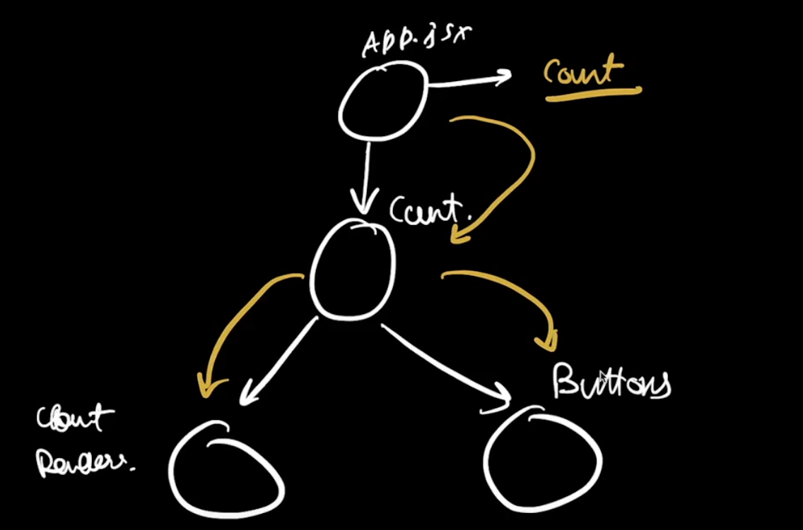
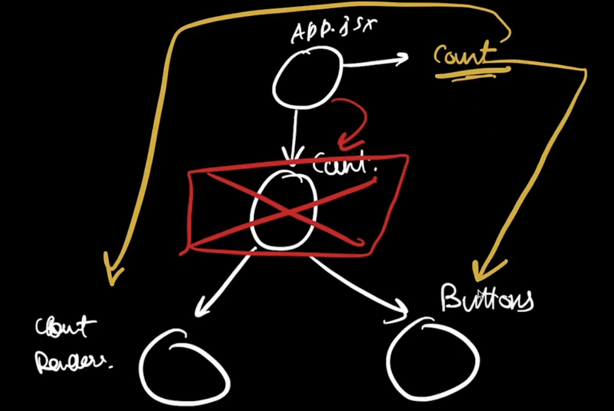
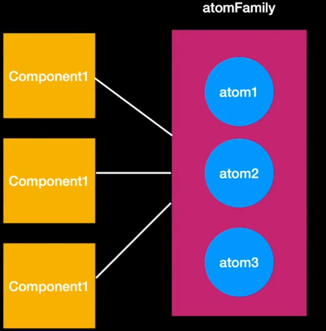

# _**Week 7.1: Routing, Prop Drilling, Context API**_

## Routing

Some terminology to know before going into Routing:

**Single Page Applications**: Dynamically changing the page and not re-fetching source code for each page navigated to.

- When visiting a website, the server sends an _`index.html`*_ file, along with associated _`style.css`_ and _`index.js`_ files. Navigating to different pages prompts the browser to request a new set of HTML, CSS, and JavaScript files from the server, causing a full page reload. This can result in a brief white flash as the new page loads, a process known as a **"hard reload"** or **"full page reload."**

- In a React application, the initial server response provides a minimal _`index.html`_ file, bundled JavaScript containing the application logic, and CSS. As users navigate the site, React dynamically updates the view by rendering new content client-side, without requesting additional files from the server. This avoids full page reloads, enabling seamless and faster navigation. This is also called as **'client side routing'**.

**Client side bundle**: The bundle of minimal code that the server provided React when rendering the page. Further code required for dynamic content are genrally fetched through APIs.

**Client side routing**: Routing of user on the webpage based on their actions i.e., dynamically changing the contents of the page received in the _client side bundle_ to display new content for the different pages.

**Frontend Routes**: routes are showin in the URL bar in the browser for each page i.e., _`x.com/home`_ is the route for homepage, and _`x.com/username`_ is the route for the profile. Redirecting users to these different pages when sokme action is done is called 'Routing'.

### _**`react-router-dom`**_

Library that helps to perform routing in React, and is the most widely used library for routing.

```jsx
function App() {
    // BrowserRouter and Routes are Wrapper Components
    // Route component takes 2 parameters
    // path -> route/path for specific page
    // element -> which component to render for that path/route
    return (
        <BrowserRouter>
            <Routes>
                <Route path="/home" element={<Home />}>
                <Route path="/profile" element={<Profile />}>
            </Routes>
        </BrowserRouter>
    )
}
```

To re-direct users we can use the _`window.location.href = "/route"`_. _`window.location.href`_ is the current browser URL and by changing that we can re-direct users to required URL/route. This is the traditional way of routing where re-loading happens and all the code is fetched again. This is because doing the above is the same as pasting the new route URL in the broswer search bar and pressing enter whcih makes the broswer think that new page is to be loaded and fetches the code from the backend server. To solve this and use client side routing provided by React, we have to make use of the **_`useNavigate()`_** hook and **_`navigate("route")`_** method.

#### **_`useNavigate`_** hook

This hook ensure that there is no "hard-reload" performed and changing the route with same same existing client bundle.

_`useNavigate`_ hook can only be used inside a component that itself is inside the **`BrowserRouter`**.

```jsx
import { useNavigate } from 'react-router-dom';

function Dashboard() {
    const navigate = useNavigate();

    function handleClick({ route }) {
        navigate(route);
    }

    /* return ( ... ) */
}
```

Now we don't see any reload in the browser tab and the navigation seems **_"instant"_**, and any fresh HTML is not fetched when routing.

### Lazy Loading

Some websites have many pages and it is not always that all the pages are visited. So, a more optimized approach than fetching all the pages at once and not using most of it is to rather load the pages as the pages are visited, so that extra redundant pages are not always loaded. This is called **_Lazy Loading_**.

React provided the Lazy Loading logic built-in with the **_`React.lazy()`_** method.

```jsx
const Dashboard = React.lazy(() => import ("./components/Dashboard"));

function App() {
  return (
    <BrowserRouter>
        <Routes>
            <Route path="/dashboard" element={<Dashboard />} />
        </Routes>
    </BrowserRouter>
  );
}
```

For this Lazy Loading logic, we need to ensure that the respective components are the default export of their files i.e., they are exported as 

**`export default funtion Component () { /* ... */ }`**


For lazy loading, React might take some time to fetch the new pages, and due to that it becomes asynchronous, and the component is **_"suspended"_** while being fetched.. For such scenarios, it is required to use the Suspense API.

```jsx
const Dashboard = React.lazy(() => import ("./components/Dashboard"));

function App() {
  return (
    <BrowserRouter>
        <Routes>
            <Route 
                path="/dashboard" 
                element={
                    <Suspense fallback={"Loading..."}>
                        <Dashboard />
                    </Suspense>
                } 
            />
        </Routes>
    </BrowserRouter>
  );
}
```

_`fallback`_ can take input as JSX and hence we can add some default compoent like a spinner to show that the page is loading. So when the component wrapped inside Suspense is being loaded, the _`fallback`_ would be displayed. In the above example, while Dashboard is being fetched, _"Loading ..."_ would be displayed. Since Dashboard is a very simple component, it is fetched in a split second and the _"Loading..."_ is not seen, but for more complex components in bigger projects it is very useful.

## Prop Drilling and Context API

**LCA (Lowest Commom Ancestor)**: It is a rule to be followed when defining state for multiple components. If there are 2 child components requiring a common state variable, the best/most optimal place to store that common state variable is at the lowest common parent. This minimized the re-renders of other unrelated components.


```jsx
import { useState } from "react";

// count and setCount present in C1
function App() {
  const [count, setCount] = useState(0);

  return (
    <div>
      <Count count={count} setCount={setCount} />
    </div>
  );
}

// since C3 is child of C2, setCount has to be passed on to C2 as well
// even though C2 doesn't use setCount, it needs it as a prop
// so that it can pass setCount to C3
function Count({ count, setCount }) {
  return (
    <div>
      {count}
      <Buttons count={count} setCount={setCount} />
    </div>
  )
}

// needs setCount which was defined in C1
// but passed to C2 and then to C3
function Buttons({ count, setCount }) {
  return (
    <div>
      <button onClick={() => setCount(count+1)}>
        Increment
      </button>
      <button onClick={() => setCount(count-1)}>
        Decrement
      </button>
    </div>
  )
}

export default App;

```

In the above example we can see the state variables and props getting a bit messy. This is a simple example where the state variable is passed through just 1 component, but for bigger codebases, where if the state variable is defined in a component and it is needed by another component way down the chain, the state variable has to be passed though so many other components along the chain unnecessarily. This is what is called **"Prop-drilling"** where we are _"drilling the props down the chain of compoennts"_.


In the above diagram, we see that a state variable defined on C1 is required by C2 and C5. C3 and C4 are unnecessarily taking the props and passing it down, even when they don't have any use for them. This makes the code un-manageable and un-appealing. It may not be a major factor in re-rendering but it causes _"syntactic uneasiness"_ when writing the code.

> Passing props is a great way to _explicitly pipe data through the UI tree_ to the components that use it.
> But passing props can become verbose and inconvinient when we need to pass some prop deeply through the tree, or if many components need the same prop. The nearest common ancestor could be far removed from the components that need the data, and _"lifting the state up"_ that high casn lead to a situation called **"prop-drilling"**.

## [Context API](https://react.dev/learn/passing-data-deeply-with-context)

Context API is a way to solve "prop-drilling" but pushing the state management outside the core React components. It is like "teleporting" the data to the components that rerquire it rather than passing it down the prop chain.

| Prop Drilling | Context API |
|:-------------:|:-----------:|
|  |  |
|  |  |

To integrate Context API,

1. Create the context. In the same/separate _`.jsx`_, file create the context as follows.

```jsx
import { createContext } from "react";
// CountContext is liek the "teleporter"
export const CountContext = createContext(0);
```

2. Wrap any component thatw ants to use the context in a **_`"Provider`_**"

```jsx
function App() {
  const [count, setCount] = useState(0);

  // CountContext has a Provider which should wraps all the
  // components that require the context
  return (
    <div>
      <CountContext.Provider value={count}>
        <Count setCount={setCount} />
      </CountContext.Provider>
    </div>
  );
}
```

3. Use the context in child components via the **_`useContext`_** hook.

```jsx
function CountRenderer() {
  // useContext(<required context value>)
  const count = useContext(CountContext);

  return (<div>
    {count}
  </div>)
}
```

Now, the _`count`_ state variable need not be drilled down as props but can be "teleported" to the deeper child components via the **`useContext(<Context>)`** hook.

The Context need not be just a number, it can be a very complex object as well.

```jsx
// 1. context.jsx
import { createContext } from "react";
export const CountContext = createContext({
    count, setCount
});

// 2. Context.Provider
function App() {
  const [count, setCount] = useState(0);

  // CountContext has a Provider which should wraps all the
  // components that require the context
  return (
    <div>
      <CountContext.Provider value={count, setCount}>
        <Count />
      </CountContext.Provider>
    </div>
  );
}

// 3. useContext
function CountRenderer() {
  const count = useContext(CountContext); // only count used

  return (<div>
    {count}
  </div>)
}

function Buttons() {
  // de-structuring and accessing both count and setCount
  const { count, setCount } = useContext(CountContext);

  return (
    <div>
      <button onClick={() => setCount(count+1)}>
        Increment
      </button>
      <button onClick={() => setCount(count-1)}>
        Decrement
      </button>
    </div>
  )
}
```

# _**Week 7.2: State management, Recoil**_

Context API lets to "teleport" the state and avoid unnecessary props, but it still doesn't solve the re-rendering problem. And for that, "state mannment" has to be used to obtain more performant solutions.

**State management**: cleaner way to store state of the app, by removing state away from the components, where the whole codebase can be divided into to separate parts, one for state logic and another for the frontend UI components.

## **Recoil**: state management library

**atom**: smallest unit of state defined outisde the component and can be teleported to any component.

- in the folder structure, we have to define a _`store`_ folder containing another folder _`atoms`_, inside which we can define our "atoms" in _`.js`_ files. To define an atom we can use the _**`atom({key, default})`**_ method provided by Recoil

  ```jsx
  import { atom } from "recoil";

  export const countAtom = atom({
    key: "countAtom", // unique way to identify this atom
    default: 0, // default value of the atom
  });

  ```

- the "state" is now defined outisde the main components, in a separate "store" directory.
- if there are multiple atoms, we need to ensure that 2 atoms should not have the same key and it must be unique for each atom we define.
- _`default`_ need not just be a value and can be some async function also, when we need to define the default value based on some backend call or some logic

_**`useRecoilState, useRecoilValue, useSetRecoilState`**_

- _`useRecoilState()`_: same like useState, where it gives a state variable and a way to update the given state variable.

  ```jsx
  // needs both the state variable and to update the state
  function Buttons() {
    // very similar to useState()
    const [count, setCount] = useRecoilState(countAtom);

    return (
      <div>
        <button onClick={() => setCount(count + 1)}>Increment</button>
        <button onClick={() => setCount(count + 1)}>Decrement</button>
      </div>
    );
  }
  ```

- _`useRecoilValue()`_: gives only the value of the state variable and used when we dont need to worry about changing the state value.

  ```jsx
  // just need the final value of the state variable
  function CountRenderer() {
    const count = useRecoilValue(countAtom);
    return <div>{count}</div>;
  }
  ```

- _`useSetRecoilState()`_: gives a way to update the state variable and used when we have to only update given state variable.''

  ```jsx
    // needs both the state variable and to update the state
    function Buttons() {
      const setState = useSetRecoilState(countAtom);

      // this works because we can get count in setCount 
      // by using arrow function and previous value logic, where
      // setCount(prevValue => prevValue + 1) increments the previous value

      return (
        <div>
          <button onClick={() => setCount(count => count + 1)}>Increment</button>
          <button onClick={() => setCount(count => count + 1)}>Decrement</button>
        </div>
      );
    }
  ```

- _`useRecoilState()`_ basically gives what _`useRecoilValue()`_ and _`useSetRecoilState()`_ returns, but when we have to specifically do only one or the other, we can go for the one that the component requires.

**`RecoilRoot`**: component provided by Recoil that must wrap all the components that need to use the state variable.

> NOTE: Don't use React 19 with Recoil right now. IT WILL BREAK. Downgrade to React 18 using `npm install react@18 react-dom@18`

**selector**: represents a "**derived**" state, similar to how _`useMemo()`_ was used to wrap state-based calculations previously.

```jsx
export const evenSelector = selector({
  key: "evenSelector",
  get: ({ get }) => { // function
    const count = get(countAtom); // dependency
    return count % 2;
  },
});
```

The selector can be defined in the same _`.js`_ where atoms were defined or another file. Similar to _`useMemo(func, [dependency])`_, selector also needs a function dependecy but the syntax is different.

- every selector must have a unique key, as seen with atoms also.
- there is a "_`get`_" key whose value is a function with a "_`get`_"  argument.
- within the function, when using the state variable, the get argument is used to tell Recoil that the state variable which is being accessed is the dependency and re-render only when it changes, i.e., _`const state = get(atom)`_
- now, the selectore depends on the _atom_ that is used in _`get()`_, and there can be more than just 1 dependency for the selectore by using multiple _`get()`_.

  ```jsx
  export const profileNotificationCountSelector = selector({
    key: "profileNotificationCountSelector",
    get: ({ get }) => {
      // 4 atoms are used here and the selector depends on all 4
      const networkNotificationCount = get(networkAtom);
      const jobsNotificationCount = get(jobsAtom);
      const messagingNotificationCount = get(messagingAtom);
      const notificationCount = get(notificationsAtom);

      // derived value from all 4 atom's values
      return (
        networkNotificationCount +
        jobsNotificationCount +
        messagingNotificationCount +
        notificationCount
      );
    },
  });
  ```

- to use the selector, we can just send the selector name as an argument to _`useRecoilValue()`_.

# _**Week 7.3: Recoil Deep Dive**_

Advantage of using Selectors over _`useMemo`_ is that, _`useMemo`_ is good for local derivations, but when we need to use the same derivation globally (in other components), Selectors are better as they can be used anywhere with the _`useRecoilValue()`_ hook.

## **Asynchronous Data queries**

Till now, we have worked with hardcoded values, and not hit any backed to fetch tha values.

```jsx
// atom.js
export const notifications = atom({
  key: "notificationsAtom",
  default: {
    network: 0,
    jobs: 0,
    messaging: 0,
    notifications: 0,
  },
});

// TopBar.jsx
export const TopBar = () => {
  // initially value set to 0
  const [notificationsCount, setNotificationsCount] =
    useRecoilState(notifications);
  const totalNotificationsCount = useRecoilValue(totalNotificationSelector);

  // when compont mounts, backend call happens and value updates
  // but, whenever, re-renders and does backend call,
  // we see for a split second, value is shown as 0, and the updated
  useEffect(() => {
    axios.get("http://localhost:8080/notifications").then((res) => {
      setNotificationsCount(res.data);
    });
  }, []);

  return /* ... */;
}
```

Here, we are defaulting the atom's values as 0 and then updating it later via the _`useEffect()`_, which is a messy approach. Ideally, the initial default value itself must get the value from backend, but we cannot directly add our _async_ function for the default value, because the **default key's value must be either _synchronous_ or a _selector that can be asynchronous_**.

```jsx
export const notifications = atom({
  key: "notificationsAtom",

  // async function present in the selector
  // and selector is the value of default
  default: selector({
    key: "notificationsSelector",
    get: async () => {
        const res = await axios.get("http://localhost:8080/notifications")
        return res.data
    }
  })
});
```

This is much better, and here also,m initially it takes some time to fetch and set the default value, but it is very fast and we don't see what happens, but if we add a "_artificial delay_" like

_**`await new Promise(r => setTimeout(r, 5000))`**_

before the backend call goes out, we see that until the data is fetched (i.e., while dealy is running) a **white screen** is seen and nothing renders. When the data is fetched, it immediately renders the components with the proper default values that it got from the backend.

### _**`atomFamily`**_

_`atom`_ is good when we know that only one instance is needed, but we can't dynamically create and remove atoms. This is where _`atomFamily`_ comes into picture.

Ex: in a dynamic todo application,

- **single atom for whole application**: all todos in same atom => hard-coded and cannot change dynamically.
- **1 atom per todo**: _how to create and delete todo atoms dynamically?_

| Problem (1 atom per component) | Solution (_**`atomFamily`**_) |
|:------------------------------:|:-----------------------------:|
|  |  |

_`atomFamily`_ is like a collection of atoms, so when using useRecoilValue to get a specific atom's value from the _`atomFamily`_, we have to pass the specific atom's ID to the _`atomFamily`_.

```jsx
// App.jsx
const todo = useRecoilValue(todosAtom(id))

// atoms.jsx
export const todosAtomFamily = atomFamily({
  key: "todosAtomFamily",
  default: (id) => {
    return TODOS.find((x) => x.id == id);
  },
});
```

In the above example, when we passs an _`id`_ into the atomFamily, it returns the dafault value based on the _`id`_ passed. When and _`id`_ is passed the first time it "finds" and returns appropriate defaut value and if same _`id`_ passed again, it does not run the function as the value would be cached when previously same _`id`_ was passed.

### _**`selectorFamily`**_

Same like how we can't add async call to an atom's _`default`_ value and use an async selector, _`selectorFamily`_ used when we have to add an async call to fetch default values for an _`atomFamily`_.

```jsx
export const todosAtomSelectorFamily = atomFamily({
  key: 'todosAtomSelectorFamily',
  default: selectorFamily({
    key: 'todoSelectorFamily',
    get: (id) => async ({ get }) => {
      const res = await axios.get(`http://localhost:8080/todo?id=${id}`);
      return res.data.todo;
    }
  })
})
```

The _`selectorFamily`_ now will return selectors dynamically hence, the _`get`_ value is a function that returns async functions (selectors). The function can take user-defined parameters (here it is _`id`_).

> If we use just _`selector`_, then it is like all the atoms in the _`atomFamily`_ have the same selector, with _`selectorFamily`_, each atom has it's own selector.

In the above example if there are multiple atoms with same _`id`_, the atom's default value send only 1 backend call and the value is cached and used for the replicas.

### useRecoilStateLoadable, useRecoilValueLoadable

If the atom has an async selector to fetch the default value, until the value is fetched from the server, the screen remains blank. In this scenario, _`useRecoilStateLoadable`_, _`useRecoilValueLoadable`_ are used.

**`useRecoilStateLoadable`**: mainly returns '_`state`_' and '_`contents`_'.

- _`state`_ will have a value of "**loading**" when data is being fetched and "**hasValue**" when the call is resolved.
- _`contents`_ contains the actual values returned from the server.

```jsx
function Todo ({ id }) {
  // returns todo.state and todo.contents
  const [todo, setTodo] = useRecoilStateLoadable(todosAtomFamily(id));

  if (todo.state == "loading") {
    return <h1>Loading ...</h1>
  } else if (todo.state == "hasValue") {
    return (
      <div>
        <h1>{todo.contents.title}</h1>
        <h1>{todo.contents.description}</h1>
      </div>
    )
  } else if (todo.state == "hasError") {
    return <h1>Backend call failed :(</h1>
  }
}
```

If we want just the value and don't need _setter_ method, then we can use _`useRecoilValueLoadable()`_, and the usage is the same.

> _`todo.state`_ also gets a value "**hasError**" when the server call fails due to URL mistake, server error, etc, which can be used for error handling. If error not handled gracefully, app will crash. Other methods to handle and implement same Loadable functionality is by using **_`Suspense`_** and _**`ErrorBoundary`**_ APIs.
