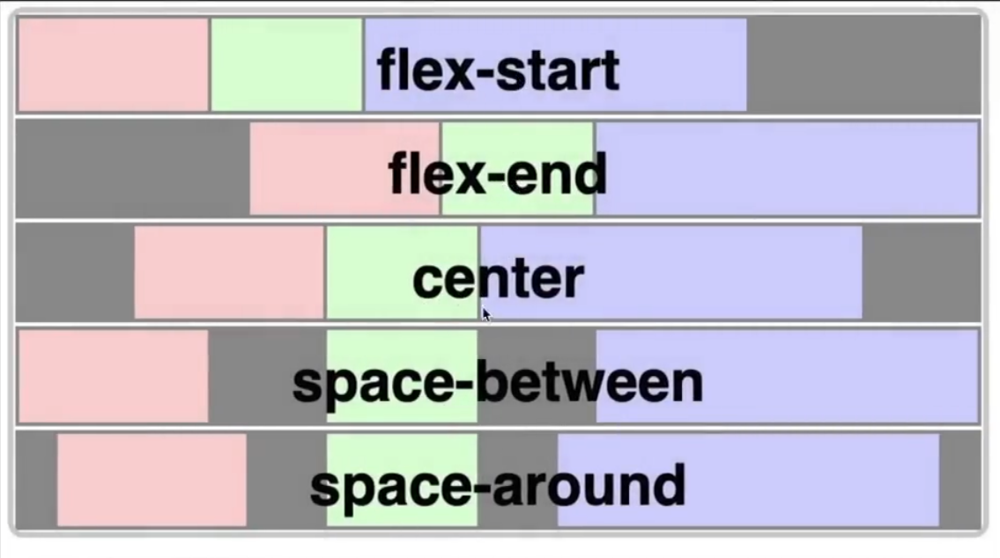

# **_Week 8.1 (12.2 from Cohort 1): YouTube clone using Tailwind CSS_**

## **Tailwind CSS Basics**

Tailwind CSS is writeen in _**`className`**_ and not in _**`style`**_ as in Vanilla CSS. This is the main distinction between the two and another main difference is that Tailwind CSS reduces the words/keywords needed to define styles when compared to Vanilla CSS, which we cans ee as we use Tailwind CSS.

### Flexbox

Used to display 'Block' elements as 'Inline' elements.

There are many parameters that can be used along with Flex to align elements as per requirement.

1. _**`justify-content`**_: modify X-axis alignment of elements
    - It has values like _`flex-start`_, _`flex-end`_, _`center`_, _`space-between`_, _`space-around`_, etc

    
    - In Vanilla CSS,

    ```js
    <div style={{display: "flex", justifyContent: "<value>"}}>
        <div style={{background: "red"}}>First div</div>
        <div style={{background: "green"}}>Second div</div>
        <div style={{background: "blue"}}>Third div</div>
    </div>
    ```

    - In Tailwind CSS, the values for justify are _`between`_, _`around`_, _`start`_, _`end`_, _`center`_

    ```js
    <div className="flex justify-<value>">
        <div style={{background: "red"}}>First div</div>
        <div style={{background: "green"}}>Second div</div>
        <div style={{background: "blue"}}>Third div</div>
    </div>
    ```

### Grids

Used to divide area equally among 'n' elements in a tabular/grid style.

- _`grid`_ keyword is used to make a parent div as a grid
- _`grid-cols-<num>`_ is used to specify the number of columns i.e., "How many divisions are done horizontally?"
- _`grid-rows-<num>`_ is used to specify the number of rows i.e., "How many divisions are done vertically?"

```js
<div className="grid grid-cols-<num_cols>">
    <div style={{background: "red"}}>First div</div>
    <div style={{background: "green"}}>Second div</div>
    <div style={{background: "blue"}}>Third div</div>
</div>
```

> _Note: These will always divide the area equally among the 'n' children_

For unequal divisions, we can use _`col-span`_ and _`row-span`_.

```js
<div className="grid grid-cols-12">
    <div 
        className="col-span-5" 
        style={{background: "red"}}
    >First div</div>
    <div 
        className="col-span-5" 
        style={{background: "green"}}
    >Second div</div>
    <div 
        className="col-span-2" 
        style={{background: "blue"}}
    >Third div</div>
</div>
```

Here, first and second elements take up 5 columsn each and last ement takes up just 2 columns.

### Responsiveness


Tailwind uses 'Mobile-first" approach where

- if no breakpoint mentioned, all screen sizes have the specified style
- if breakpoint mentioned, thotyles take effect at specified breakpoint and _"above"_ only.

It says that we should not target mobile using _`sm:<style>`_, but instead write unprefixed styles for mobile and override them for larger screens using respective prefixes.

```jsx
// sm: means small size and above get this style and due to this
// mobile devices (below sm size) have no style specified
<div class='sm:text-center'></div>

// Correct solution
<div class='text-center sm:text-left'></div>
// text-center is applied for mobile devices (below sm)
// text-left is applied to all screens incl. sm and above
```

### Basic styles

Tailwind has it's own color system with some defined keywords for colors and respective shades varying from 50th shade to 950th shade (50, 100, 150, 200, ...).

- Background colour: _`bg-<color>-<shade>` e.g., _`bg-red-300`_
- Font colour: _`text-<color>-<shade>`_ e.g., _`text-slate-800`_

We can also define our own colours either in the config file or using [] to enclose the custom colous.

Ex: _`bg-[#123456] text-[#000000]`_

- Font size: _`text-<xs/sm/base/lg/xl/2xl>`_ where **`xs = 12px`** and each tier increaes by 2px each, and base is the default font size of 16px.
- Border radius: _`rounded`_ or _`rounded-<sm/lg/full>`_ where **`full`** makes element border completely round.
- To add custom colours we can also override the tailwind colors by adding _`theme:{ extend:{ colors:{<color>:{ shade: <hexcode>}}}}`_ in the _`vite.config.js`_ file. For example,

    ```js
    import { defineConfig } from 'vite'
    import tailwindcss from '@tailwindcss/vite'
    import react from '@vitejs/plugin-react'

    // https://vite.dev/config/
    export default defineConfig({
    plugins: [react(), tailwindcss()],
    theme: {
        extend: {
        colors: {
            blue: {
            500: "#146eb4"
            }
        }
        }
    }
    })
    ```

- For Hover effects, we can use the _`hover:`_ psuedoclass like _**`hover:bg-blue-200`**_

### [_**Storybook**_](https://storybook.js.org/docs/builders/vite)

Used to expose components without rendering them (open-source components without exposing entire application)

It gives a UI where all the compoents are shown as stories which we can see and check how it looks and behaves.

1. Install the storybook package using _**`npm install @storybook/builder-vite --save-dev`**_
2. Create a _`.storybook`_ folder at the root level, inside it a main.js and add the following lines.

    ```js
    export default {
        framework: '@storybook/your-framework',
        stories: [
            '../src/**/*.mdx', 
            '../stories/**/*.stories.@(js|jsx|mjs|ts|tsx)'
        ],
        addons: ['@storybook/addon-docs'],
        core: {
            builder: '@storybook/builder-vite',
        },

        async viteFinal(config) {
            const { mergeConfig } = await import('vite');

            return mergeConfig(config, {
                optimizeDeps: {
                    include: ['storybook-dark-mode'],
                },
            });
        },
    };
    ```

    Here we are saying that we will write all our "stories" in _`src/folder/<file>.mdx`_ or _`stories/folder/<file>.stories.js/jsx/mjs/ts/tsx`_

3. Now whenever we write any components, we need to write a corresponding "story" for that component.

    ```jsx
    import type { Meta, StoryObj } from '@storybook/<framework>';
    
    import { Button } from './Button'; // actual component
    
    const meta = {
    component: Button,
    } satisfies Meta<typeof Button>;
    
    export default meta;
    type Story = StoryObj<typeof meta>;
    
    // here is where we define the "Story" and say how it
    // would be rendered finally 
    export const Primary: Story = {
        args: {
            primary: true,
            label: 'Button',
        },
    };
    ```

4. Then we can integrate it and run it.

Using the stories, any other person can look at the components, test them and make any changes without actually altering them, and the main engineer can look at the changes and integrate them if needed.

# **_Week 8.2: PayTM Clone and Recap_**

1. Clone starter repo: [Repo link](https://github.com/100xdevs-cohort-2/paytm)
2. Defining Mongoose scehmas

    ```js
    const userSchema = new mongoose.Schema({
        username: String,
        password: String,
        firstName: String,
        lastName: String
    });

    const User = mongoose.model("User", userSchema)
    ```

3. Routing File structures: Routes stored in _`/routes`_ folder.
4. Routing User requests: Using React Router to route different requests to different files in _`/routes`_ folder.

    ```js
    // /api/v1 -> index router
    const router = express.Router(); // in routes/index.js
    app.use("api/v1", router); // imported and used in ./index.js

    // router created in routes/user.js and imported in routes/index.js
    // /api/v1/users -> user router
    router.use("/user", userRouter) 

    // /api/v1/account -> account router
    router.use("/accounts", accountsRouter)
    ```

5. Adding _`cors`_, _`body parser`_ and _`jsonwebtoken`_
    - _`cors`_: connect frontend and backend as hosted on separate routes.

    ```js
    // backend/index.js
    app.use(cors());

    // allows all HTTP requests, if need to allow specific requests
    // need to pass it in a argument to cors()
    ```

    - _`body parser`_: using _`express.json()`_ middleware to support JSON data.
    - _`jsonwebtoken`_: import and create .env file with _`JWT_SECRET`_.

6. Backend Auth routes: _`/signup`_ and _`/signin`_ routes

    - _`/signup`_: creates new user if not already present and send a signed JWT back.

        ```js
        router.post("/signup", async (req, res) => {
        const body = req.body;
        // ... input validation
        const newUser = await User.create(body);
        const token = jwt.sign({ userId: newUser._id }, jwtSecret);

        return res
            .status(200)
            .json({ message: "User created successfully", token: token });
        });
        ```

    - _`/signin`_: queries DB for user and if found, returns signed JWT.

        ```js
        router.post("/signin", (req, res) => {
        const body = req.body;
        // ... input validation
        if (user) {
            const token = jwt.sign({ userId: user._id }, jwtSecret);
            res.status(200).json({ token: token });
        }
        });
        ```

7. Authentication Middleware: checks header for Authorization value and validates the token.

    ```js
    const authMiddleware = (req, res, next) => {
    const authHeader = req.headers.authorization;
    if (!authHeader || !authHeader.startsWith("Bearer")) {
        return res.status(403).json({});
    }

    const token = authHeader.split(" ")[1];
    try {
        const decoded = jwt.verify(token, JWT_SECRET);

        if (decoded.userId) {
        req.userId = decoded.userId;
        next();
        } else return res.status(403).json("");
    } catch (err) {
        return res.status(403).json("");
    }
    };
    ```

8. Backend User routes: _`/filter`_ and _`/`_

    - _`/filter`_: retrieve all users and filter them.

        ```js
        router.get("/filter", async (req, res) => {
            const filter = req.query.filter || "";
            const users = await User.find({
                $or: [
                {
                    firstName: {
                    $regex: filter,
                    },
                },
                {
                    lastName: {
                    $regex: filter,
                    },
                },
                ],
            });

            // ... sending back response
        });
        ```

    - _`/`_: allows to update firstname and lastname, and uses an _`authMiddleware`_ to authenticate user.

        ```js
        router.put("/", authMiddleware, async (req, res) => {
        // .. input validation

        // as we are using authMiddleware to perform authentication,
        // after successfull authentication, userId is added in the req
        // which is what we can use as a confirmation that user is auth'd

        await User.updateOne(req.body, { id: req.userId });
        return res.status(200).json({ message: "Updated successfully" });
        });
        ```

9. Bank-related Schema:  _`Accounts`_ table that contains users and their respective balances.

    > For payment applications, we don't store balances a Float as it will cause precision issues (88.88 sometimes becomes 88.877777), so we store integer will all the digits and remember where the decimal point is to be placed. (8888 means 88.88).

    - In Accounts table, we need to create reference to Users table (like a relation between 2 tables).

        ```js
        const accountSchema = new mongoose.Schema({
        userId: {
            type: mongoose.Schema.Types.ObjectId, // reference to User model
            ref: 'User'
        },
        balance: {
            type: Number,
            required: true
        }
        })
        ```

10. Transactions in DB: Multiple DB transactions must be "**atomic**" i.e., all should update or none should update (no partial transactions => rollbak is transaction not completed).
11. Initialize balances on signup: Give new user a random balance between 1-10000, just to seed the DB.

    ```js
    await Account.create(
        newUser._id,
        1 + (Math.random() * 10000) // random balance b/w 1-10000
    );
    ```

12. New router for Accounts: router that handles requests coming to _`/api/v1/accounts`_ in _`routes/accounts.js`_.
13. Balance and Transfer endpoints for Account Handler:

    - _`/balance`_: uses the _`userId`_ in _`request`_ object and retrieved balance of corresponding user from Account table.

        ```js
        // authentication via authMiddleware => userId in req obj
        router.get("/balance", authMiddleware, async (req, res) => {
        const account = await Account.findOne({ userId: req.userId });
        res.status(200).json({ balance: account.balance });
        });
        ```

    - _`/transfer`_: transfer money between 2 accounts

        - Solution without transactions:

        ```js
        router.post("/transfer", authMiddleware, async (req, res) => {
            const from = req.userId;
            const { amount, to } = req.body.to;

            const account = await Account.findOne({ userID: from });
            // ... balance check

            const toAccount = await Account.findOne({ userId: to });
            // ... account existence check

            // update sender's account
            await Account.updateOne({ userId: from },{ 
                    $inc: { balance: -amount},
                }
            );
            
            // update recipient's account
            await Account.updateOne({ userId: to },{ 
                    $inc: { balance: amount},
                }
            );
        });
        ```

        - Solution with transactions:  

        ```js
        router.post("/transfer", authMiddleware, async (req, res) => {
            // start a session and a transaction
            const session = await mongoose.startSession();
            session.startTransaction();

            const { amount, to } = req.body;

            // .session(session) => keeps it within session
            const account = await Account.findOne({ userId: req.userId }).session(
                session
            );

            // abort the transaction if any check fails
            if (!account || account.balance < amount) {
                await session.abortTransaction();
                return res.status(400).json({ message: "Insufficient balance" });
            }

            const toAccount = await Account.findOne({ userId: to }).session(session);

            if (!toAccount) {
                await session.abortTransaction();
                return res.status(400).json({ message: "Invalid account" });
            }

            // Transfer
            await Account.updateOne(
                { userId: req.userId },
                { $inc: { balance: -amount } }
            ).session(session);

            await Account.updateOne(
                { userId: to },
                { $inc: { balance: amount } }
            ).session(session);

            // commit transaction when all operations done
            // if any abort before commit => transaction rolls back
            await session.commitTransaction();
            res.status(200).json({ message: "Transaction successful" });
        });
        ```

        All operations between _`startTransaction`_ and _`commitTransaction`_ will be executed if not _`abortTransction`_ in between => rolls-back if any check fails and transaction aborted before commit.

        Also _`mongoose`_ enmsures that any data read from DB during transaction will not get updated before transaction committed or aborted => no read-write problem i.e., gives a _`WriteConflict error`_ and fails the initial transaction.
