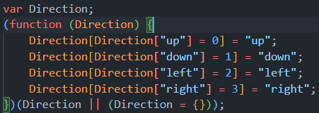
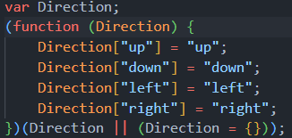

# _**Week 9.1: Custom Hooks**_

Hooks are a feature introduced in React 16.8 that allows us to access state and life-cycle events. They are essentially functions provided by React for intrect with the state and life cyle of a functional component.

## Types of Components

Earlier there were class based components, and later functional components were introduced. Class based components had state as _`state variables`_ and life cycle events as _`methods`_, which when transitioned to functional components, are used in the form of hooks.

### Class-based component

```jsx
class Component extends React.Component {
    constructor(props) {
        // props passed from parent/super class
        super(props);

        // state is a "state variable"
        this.state = {
            count: 0
        }
    }

    // action methods
    incrementCount = () => {
        this.setState({ count: this.state.count + 1 });
    }

    // life cycle events 
    componentDidMount = () => {
        // run this codew when component is mounted
    }

    componentWillUnmount = () => {
        // clean-up when component will be unmounted
    }

    // component return value
    render() {
        return (
            <div>
                <p>{this.state.count}</p>
                <button onClick={this.incrementCount}>Increment</button>
            </div>
        )
    }
}
```

### Functional component

```jsx
function Component({ props }) {
    // useState hook to define state variables
    const [state, setState] = useState(0);

    //  action functions
    const incrementCount = () => {
        setState(state+1);
    }

    useEffect(() => {
        // run this code when component mounts (because dep = [])

        return () => {
            // clean-up code (when component unmounts)
            // similar to componentWillUnmount in class component
        }
    }, [])

    return (
        <div>
            <p>{state}</p>
            <button onClick={() => {incrementCount}}>Increment</button>
        </div>    
    )
}
```

## Custom Hooks

Hooks created by the developer, which is just another function starting with "_`use`_", and interanally used another hook (_`useState`_, _`useEffect`_, other custom hooks).

Custom Hooks are used in many scenarios like:

1. Data Fetching Hooks
2. Browser functionality related hooks
3. Performance/Timer based hooks

### Data Fetching hooks

```jsx
function App() {
  // state logic
  const [todos, setTodos] = useState([]);

  useEffect(() => {
    // data fetching logic
    axios.get("http://localhost:8080/todos").then((response) => {
      setTodos(response.data.todos);
    });
  }, []);

  // rendering logic
  return (
    <div>
      <h1>Todos</h1>
      {todos.map((todo) => {
        return (/* todo rendering */);
      })}
    </div>
  );
}

function Todo({ title, description }) { /* render single ToDo */ }

export default App;

```

The problem with the above example is that all the logic are stuufed into single file i.e., the state logic, data fecthing, and rendering are all in 1 file itself. Custom hooks let us to clean the code by defining hooks that abstract away certain logic and make the code readable.

With custom hooks, we can create a _`usetodos`_ hook that encapsulates the state and data fetching logic and this type of custom hooks are called as "**Data Fetching hooks**".

```js
// Custom hook that fetches todos from a backend
export const useTodos = () => {
  // state logic
  const [todos, setTodos] = useState([]);

  // Data Fetching
  useEffect(() => {
    axios.get("http://localhost:8080/todos").then((response) => {
      setTodos(response.data.todos);
    });
  }, []);

  return todos;
};
```

So now in the main App.jsx, we only have the rendering logic and the custom hook that fetches the data (and any other child components), which is objectively much cleaner.

```jsx
function App() {
  // custom hook to fetch data
  const todos = useTodos();

  // rendering logic
  return (
    <div>
      <h1>Todos</h1>
      {todos.map((todo) => {
        return (/* todo rendering */);
      })}
    </div>
  );
}

function Todo({ title, description }) { /* render single ToDo */ }

export default App;
```

The functionality of the custom hook need not be only to send back data, but other data as well. An extened version of _`useTodos()`_ can also send back a _`loading`_ variable that is true when data fetching is completed and false otherwise.

```js
export const useTodos = () => {
  const [todos, setTodos] = useState([]);
  const [loading, setLoading] = useState(true);

  useEffect(() => {
    axios.get("http://localhost:8080/todos").then((response) => {
      setTodos(response.data.todos);
      setLoading(false);
    });
  }, []);

  return { todos, loading };
};

// use loading variable in App.jsx to render different elements
function App() {
  const { todos, loading } = useTodos(refreshTime=5);
  return (
    <div>
      {!loading ? (
        /* actual content based on backend data */
      ) : (
        <p>Loading ...</p>
      )}
    </div>
  );
}
```

**Auto-refreshing hooks**: Scenario where we want to re-poll the backend every 'n' seconds, or some other action done again after set period of time ("refresh" the data).

```js
export const useTodos = (refreshTime) => {
  const [todos, setTodos] = useState([]);
  const [loading, setLoading] = useState(true);

  const fetchTodos = () => { /* fetch todos from backend */ };

  useEffect(() => {
    // Interval that excutes the passed function
    // every n seconds, but only thing it that Interval
    // first executes after the 'n'seconds so run once
    // while Interval is waiting for the first 'n' seconds.
    const intervalID = setInterval(() => fetchTodos(), refreshTime * 1000);
    fetchTodos();

    // clean-up
    return () => {
      clearInterval(intervalID);
    };
  }, [refreshTime]);

  return { todos, loading };
};

// So now in App.jsx, we use
const { todos, loading } = useTodos(10) // or some 'n'
```

The clean-up is required as if throughout the life-cycle of the _App_ component, if the _`refreshTime`_ changes, we need to re-run _`useEffect()`_ again, so when this happens we create another _Interval_ and the previous _Interval_ is also running, so in the clean-up, the previous _Interval_ is cleared and only 1 proper "clock" is running at a time.

### Browser functionality related hooks

1. _`useIsOnline`_ hook: returns true or false based on whether user is currently online or not.

    - uses '_`online`_' and '_`offline`_' events on window.
    - _`window.navigator.onLine`_ returns true if user is online and false if offline

2. _`useMousePointer`_ hook: uses '_`mousemove`_' window event and returns X and Y positions of the mouse pointer.
3. _`useDimensions`_ hook: uses the '_`resize`_' window event and _`window.innerWidth`_, _`window.innerHeight`_ properties to return the dimension of the screen when resized.

### Performance/Timer based hooks

1. _`useInterval`_ hook: similar to _`useEffect`_ where it takes a function as input and a delay after which the passed function will be executed for every '_`delay`_' period of time.

2. _`useDebounce`_ hook: takes in a continuously changing state variable and retuns a deferred/debounced value after, '_`delay`_' period of time.

# _**Week 9.2: Typescript Intro**_

JavaScript is a loosely typed and interpreted language like Python where we don't mention the data types while declaring variables. TypeScript, Java, C, etc are strongly typed where data type has to be mentioend while declaring the variable and is more strict when it comes to type-casting.

**TypeScript adds types on top JavaScript.**

TS does not run in browser or even in Node, and it does not even actually run. _**TS gets transpiled down into JS**_ which then runs in browser or Node. TS will check the types and variables and compiles into JS only when there are no such data type errors, which is done by a TypeScript compiler.

## TypeScript Basics

### **Defining variables**

Declaration is same as JS but we add the type following the variable name like: _**`const <var_name>: <d_type> = <value>`**_

Ex: _`const x: number = 24;`_

### Executing TS code

We cannot execute the TS file directly and have to compile it down to JS to run it via NodeJS.

```sh
$ ls
  package.json tsconfig.json script.ts
$ tsc -b
$ ls
  package.json tsconfig.json script.ts script.js
$ node script.js
```

Compiled JS file is created which can be executed using NodeJS. If there are any erros in the TS file, error is shown and the JS file is not created.

### Functions and Arguments

Assigning type to arguments: _**`function func (arg: d_type) {}`**_

Multiple arguments: _**`function func (arg1: d_type, arg2: d_type) {}`**_

Return value data type: _**`function func () : <return d_type> {}`**_

> **Type Inference**: Mentioning return value data type is not necessary as TS will "infer" the return value data type, but it is a good practice to add the data type for the function's return value also.

```ts
function greet(fname: string) {
  console.log(`Hello ${fname}`)
}

function sum (a: number, b: number): number {
  return a+b;
}
```

Functions as arguments: _**`funtion func(fn: (args) => <return d_type>) {}`**_

```ts
function runAfter1S (fn: () => void) {
  setTimeout(fn, 1000);
}

function runAfter1SNumber (fn: () => number) {
  setTimeout(fn, 1000);
}

// no args, no return value
runAfter1S(() => {
  console.log("Hi")
})

// no args with some return value
runAfter1SNumber(() => {
  return 200;
})
```

### _`.tsconfig`_ parameters

1. _`target`_: specifies the ECMAScript version to which the _`tsc`_  will compile the TypeScript code.
2. _`rootDir`_: tells where the source TypeScript file is.
3. _`outDir`_: tells where to create the compiled JavaScript code.
4. _`noImplicitAny`_: if _`true`_ then won't allow variables to have implicit '_`any`_' type and needs to have defined data type, but if _`false`_, then variables can implicitly have the '_`any`_' type (when no data type is mentioned).
5. _`removeComments`_: is set to _`true`_, then removes any comments from the TS file when compiled to JS.

### Interfaces

When we need to assign data types to an object, we have to create an "Interface" and can use it multiple times wherever needed, instead of redefining the types each time for different functions.

```ts
const user = {
  firstname: "Pavan",
  lastname: "Bhat",
  age: 22
}

// interface <int_name> { key: d_type, ... }
interface User {
  firstname: string;
  lastname: string;
  age: number;
}

// use interface in place of the object
function isLegal (user: User) {
  return (user.age > 18 ?  true :  false)
}

console.log(isLegal(user) ? "Legal" : "Under Age")
```

**Optional argument** in interfaces: We can define data types for keys in an object, and tell that it is optional (user may pass it or not), but adding a '?' before the colon, like

```ts
interface User {
  firstname: string;
  lastname: string;
  age: number;
  email?: string; // optional argument
}
```

### Class implementing Interface

We can define class as impelmenting an interface that ensure that an instance of that class will always have to keys mentioned in the interface.

```ts
interface Person {
    name: string;
    age: number;
    greet: (phrase: string) => void;
}

class Manager implements Person {
    name: string;
    age: number;

    constructor(n:string, a: number) {
        this.name = n;
        this.age = a;
    }

    greet(phrase: string) {
        console.log(`${phrase} ${this.name}`);
    }
}

// now when we create an instance we canb be sure
// that instance has name, age and greet()
const manager = new Manager("Pavan", 22)
manager.greet("Hello! I am")
```

### Types

Very similar to interfaces where we can define the data types of objects but they also have other functions.

```ts
// type <type_name> = {obj}
type User = {
  fname: string;
  lname: string;
  age: number;
}

const user: User = {
  fname: "Pavan",
  lname: "Bhat",
  age: 22
}
```

Other functions of _`types`_:

- **Unions** (OR): _**`type <type_name> = <d_type1> | <d-type2>`**_.

  - _`d_type1`_ and _`d_type2`_ can be anything from just _`string`_ or _`number`_ to _aggregated types_ (objects).
  - Used when we want to say the type can have either type 1 **or** 2.

- **Intersection** (AND): _**`type <type_name> = <d_type1> & <d-type2>`**_.

  - Used when we want a type to have all the types for both types 1 **and** 2
  - Intersection can be between 2 types, 2 interfaces or a type and interface, but the returned type (LHS) must be a type and not an interface.
  
    ```ts
    type Employee = {
      name: string;
      startDate: Date;
    }

    interface Manager {
      name: string;
      department: string;
    }

    type TeamLead = Employee & Manager;

    const teamLead: TeamLead = {
      name: "Pavan",
      startDate: new Date(),
      department: "IT"
    }
    ```

> **Interfaces allow to implement classes, and Types allow to perform Union and Intersection operations between types and interfaces.**

### Arrays

For arrays, we can just add a _`[]`_ after the array type saying that it is an array of that type.

```ts
function maxValue(arr: number[]) { /* ... */}

// or it can be defined in a type and mentioned in the function
type NumsArr = number[]
function maxValue(arr: NumsArr) { /* ... */}
```

**Non-null Assertion**: With arrays, TS gives a new kind of error saying that array might be undefined or array elements might be undefined. To oorride this, we can add an '_`!`_' wherever we are accessing array elements, which tells TS that we are sure that this variable is not undefined and has a value

```ts
function maxValue (arr: number[]) {
  let max = arr[0]!; // says that arr[0] has a value
  for(let i=0; i<arr.length; i++) {
      // arr[i]! says that it is not undefined so error wont be shown
      if (arr[i]! > max) {
          max = arr[i]!
      }
  }

  return max;
}
```

### Enums

Feature in TS that allows to define set of named constants. If we define that a variable is a string and use it further in some logic, there is an edge case where the input will be a string but some random value that fails the further logic, so we can setup TSC to warn us for thse kind of inputs by using _`enums`_.

Ex: In a game there are 4 inputs: Up, Down, Left and Right or 1,2,3,4. If we define the keypress handler function with just string/number arguments, user can still pass random string/numbers.

```ts
function performAction(keypress: string) {
  // ... if checks and logic
}

performAction("Up");
performAction("Right");
performAction("Rightcvhev"); // this might crash the function
```

One way to solve this without _`enums`_ is but using _`type`_, by constraining the inputs that can be passed.

```ts
type KeyPressed = "up" | "down" | "left" | "right";

// no argument type is not string and the type 
// forces it to be either one of the 4 mentioned values only
function performAction(keypress: KeyPressed) {
  // ... if checks and logic
}

performAction("up");
performAction("right");
performAction("Rightcvhev"); // gives an error and does not compile
```

Other solution is using _`enums`_, which helps create a human-readable representation of constants like "up", "down", ...

Enum stands for Enumeration and defines the set of values a variable/argument can take.

```ts
enum Direction {
  Up, Down, Left, Right
}

// now d_type of argument is the enum which means that
// keypress argument can take any of the values in the enum
// when we type Direction., it gives suggesstions of available values
function performAction(keypress: Direction) {
  if (keypress == Direction.Up) { /* ... */ }
  if (keypress == Direction.Down) { /* ... */ }
  if (keypress == Direction.Left) { /* ... */ }
  if (keypress == Direction.Right) { /* ... */ }
}

performAction(Direction.Up);
performAction(Direction.Right);
// now we are restricted to use only the values that the 
// enum provides us as it has to be accessed through it and
// any random value will throw an error

performAction("Rightcvhev"); // gives an error and does not compile
```

Also when the TS code containing _`enums`_ gets compiled we see that in JS, it is essentially creating the object and assigning numbers like 0,1,2,3 to the values of the _`enum`_.



If we want the compiled code to also have string values and not 0,1,2,3, we have to specify string values for **each** element of enum (either all are string or all are numbers, cant define string value for few elements and leave the rest), but if we want to assign different numbes (in seqeuence), then we can just assign a number to0 the first value and leave the rest, they will automatically get assigned the next numbers in the sequence.

```ts
// assigning strings (all need to be assigned a value)
enum Direction {
  up="up",
  down="down",
  left="left",
  right="right"
}

// assigning numbers (first one is enough if in sequence)
enum Direction {
  up=10, // 10
  down,  // 11
  left,  // 12
  right  // 13
}

enum Direction {
  up=10,    // 10
  down=20,  // 20
  left,     // 21
  right     // 22
}

// another example with HTTP status codes
// makes routes more user-friendly and readable
enum ResponseStatus {
  Success = 200,
  Redirected = 301,
  NotFound = 411,
  ServerError = 505,
}
```



### Generics

Problem statement: What if an array passed as argument should be of type _`number`_ or _`string`_.

Approach with _`type`_:

```ts
type Input = number | string

function firstEelement(arr: Input[]) {
  return arr[0];
}

const value = firstElement(["Pavan", "Bhat"])
console.log(value.toUpperCase());
```

Above code throws an error saying that _`value`_ of type _`Input`_ does not have _`toUpperCase`_ method, more specifically  _`value`_ of type _`number`_ does not have _`toUpperCase`_ method, even though the function returned string, i.e., TS cannot infer that output is string if input is string array, and hence enforces the actual type of the input array which is _`number | string`_ and not just string.

Also, with the above approach user can send in an array with numbers and strongs, which ideally should contain only numbers or only strings.

**Generics** allow to create components/variables that work with any data type whiels till providing compile time type safety.

```ts
// <T> defines a generic which menas it can accept any type
// and the type passed will be the type returned
// i.e., if string is passed return value will be string type as well
function identity<T>(arg: T): T {
  return arg;
}

// need not explicitly mention type here, but good practice
// but this is needed if we want to avoid mixed inputs in arrays
// output1 will be of type string now
let output1 = identity<string>("string");
// output2 will be of type number now
let output2 = identity<number>(24);

// type-specific methods will work now as the type is proper
// and not ambiguous like string | number
console.log(output1.toUpperCase()) // STRING
console.log(output2 + 100)         // 124
```

Here "**T**" can be thought of like a placeholder and when we pass input of certain type, the argument input type and return input type is set to that.

### Exporting and Importing modules

TS follows ES6 where _`import`_ and _`export`_ statements instead of "_`require`_".

Non ES6 format:

```js
const express = require('express');
// ...
module.exports = { app, /* other exports */ }
```

ES6 format:

```js
import express from 'express';
// ...
export app;
/* other exports */
```

Another concept in ES6 is default exporting. If the exports from a file are like:

```js
// exports.js
export app; // normal export
export default object; // default export

// While importing in another file,
import { app } from 'exports.js';
import obj from 'exports.js';

// or
import obj, { app } from 'exports.js';
```

**Normal exports** need to be _**de-structured and need to have the same variable name**_ in both importing and exporting files. **Default exports** _**need not be de-strctured**_ as it is imported by "default" and we _**can change the name of the variable**_ as needed in the importing file.
